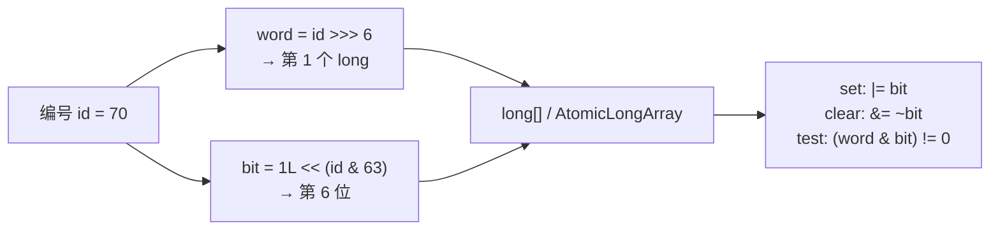
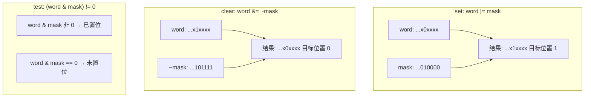

# 位图（Bitmap）：用 bit 表达大规模布尔状态

> 位图首先是一种**通用数据结构思想**，不是 Disruptor 专有技巧。本仓库多生产者 demo 里的 `availableBuffer` 只是其中一个客户：用「每槽 1 bit」记录「是否已发布」。
>
> 相关文档：
>
> - [并发编程的核心思想](./并发编程的核心思想.md)
> - [位运算基础](./位运算基础.md)
> - [多生产者卡住与错读（位图逐步推演）](../mq-learning/bugfix-multi-producer-stall.md#252b-位图--数组到底怎么存为什么不直接用下标)
> - [MiniMultiProducerDemo.AvailableBuffer](../../code/disruptor-lab/src/main/java/io/ddia/disruptor/lab/multiproducer/MiniMultiProducerDemo.java)

---

## 目录

1. [一句话定义](#1-一句话定义)
2. [为什么这是一个非常好的方法](#2-为什么这是一个非常好的方法)
3. [核心操作：怎么寻址、置位、清位、查询](#3-核心操作怎么寻址置位清位查询)
3.1. [图里每一位运算符的原理（不烧脑版）](#31-图里每一位运算符的原理不烧脑版)
4. [和 boolean[] / Set / 哈希表比什么时候该用](#4-和-boolean--set--哈希表比什么时候该用)
5. [实际使用场景](#5-实际使用场景)
6. [和本仓库 Disruptor demo 的对照](#6-和本仓库-disruptor-demo-的对照)
7. [实现时要注意的坑](#7-实现时要注意的坑)
8. [小结](#8-小结)

---

## 1. 一句话定义

> **把「很多个只要 是/否 的答案」压进连续的 bit 里：编号 → 第几个 word → 第几位 → 用 `| & ~ <<` 读写。**

本质是「大规模布尔数组」的紧凑实现：

```text
逻辑视角：  flag[0], flag[1], flag[2], …, flag[N-1]   每个只要 true/false
物理视角：  若干个 long/int，每个装 64/32 个 flag
```



---

## 2. 为什么这是一个非常好的方法

在「编号密集、每元素只要布尔」的前提下，位图几乎总是更好的默认选择之一。

### 2.1 空间：约 8 倍于 `boolean[]`，远小于 `HashSet`

| 存 1024 个布尔 | 大约占用 |
|---|---|
| `boolean[1024]` | ~1 KB（JVM 里 boolean 常按 1 byte） |
| 位图 `long[16]` | **128 字节**（1024 bit） |
| `HashSet<Integer>` | 数千到上万字节（对象头、装箱、桶） |

```text
N 个布尔 ≈ N/8 字节（位图）
N 个布尔 ≈ N 字节（boolean[]）
N 个 Integer 集合 ≈ 远大于 N 字节（哈希）
```

当 N 到百万、千万（签到、在线、页面分配）时，这个差距是能不能放进内存/缓存的差别。

### 2.2 时间：下标直达，O(1)，且更吃缓存

- 不需要哈希探测、不需要树旋转
- 64 个相邻状态挤在同一个 `long` 里，一次读缓存行能覆盖很多 flag
- CPU 对位运算极度友好

### 2.3 语义清晰：天然表达「集合隶属 / 开关状态」

很多业务本来就是：

```text
这个用户今天签到了吗？
这个页框空闲吗？
这个槽位已发布吗？
这个权限开了吗？
```

用 bit 表示，比「再套一层对象」更贴切。

### 2.4 可组合：交、并、差只要按 word 做位运算

```java
// 两个位图的交集（同时满足）
c[i] = a[i] & b[i];
// 并集
c[i] = a[i] | b[i];
// 差集
c[i] = a[i] & ~b[i];
```

这在「标签过滤、权限合并、索引求交」里非常常见；Roaring Bitmap 等库就是在此思想上做压缩与分片。

### 2.5 什么时候「不够好」、该换方案

| 情况 | 更好的选择 |
|---|---|
| 编号极稀疏（1 和 10^12 都出现） | Roaring Bitmap / 哈希集合 |
| 每元素要存复杂信息 | 结构体数组、`Entry[]` |
| 需要区分「第几代 / 第几圈」且不宜 clear | 如 LMAX：`int[]` 存轮次 flag |
| 多线程改同一 word 的不同 bit | 必须 CAS / `AtomicLongArray`，不能裸 `long[]` 读改写 |

**结论：位图好，是因为在正确的问题形状下，它同时优化了空间、局部性和运算模型；不是因为它能替代一切状态存储。**

---

## 3. 核心操作：怎么寻址、置位、清位、查询

### 3.1 图里每一位运算符的原理（不烧脑版）

先建立直觉：**把一个 `long` 想成 64 个并排开关**，每位只能是 0 或 1。位运算就是「一次同时拨很多开关」，规则固定、没有魔法。

看上去符号多，其实位图只用到下面几样；学会这几样，图里的公式就全通了。

#### `<<` 左移：制造「只有某一位是 1」的面具（mask）

```text
1L << 6

1 的二进制（示意低 8 位）：  0000 0001
左移 6 位：                  0100 0000   ← 只有第 6 位是 1
```

「第几位」从右边（最低位）数，从 0 起：`1L << 0` 是最右边那一位，`1L << 6` 是再往左数 6 格。

位图里：`bit = 1L << (id & 63)` 就是造一把**只对准目标槽**的钥匙，别的位全是 0。

#### `>>>` 无符号右移：除以 2 的幂（算落在第几个 long）

```text
70 >>> 6  ≡  70 / 64  = 1（整数除法）
```

因为 `2^6 = 64`。右移 6 位 = 除以 64，得到「第几个 word」。  
（Java 里对正数 `>>` 和 `>>>` 结果一样；位图编号非负，习惯写 `>>>`。）

#### `& 63`：取模 64（算 long 里面的第几位）

```text
70 & 63  ≡  70 % 64  = 6
```

因为 `63 = 0b111111`（低 6 位全 1），`& 63` 只保留低 6 位，正好是除以 64 的余数。  
所以：

```text
wordIndex = id >>> 6      // 第几个 long
bitOffset = id & 63       // 这个 long 里第几位
mask      = 1L << bitOffset
```

#### `|` / `|=`：按位或 —— **置 1（set）**，不动其它位

规则：两位里**有一个是 1，结果就是 1**。

```text
假设 words[1] 当前是：  ... 0000 0000
mask = 1L<<6：         ... 0100 0000
words[1] | mask：      ... 0100 0000   ← 第 6 位被打开

若原来第 6 位已是 1，再 | 一次还是 1（幂等）
若原来其它位已是 1，那些位保持 1（只加不减）
```

`words[i] |= mask` 就是「打开这一位开关」。

#### `&`：按位与 —— **查询（test）**，看目标位是不是 1

规则：两位**都是 1，结果才是 1**。

```text
words[1]：  ... 0100 0000
mask：      ... 0100 0000
& 结果：    ... 0100 0000  ≠ 0  → 该位是 1，已标记

words[1]：  ... 0000 0000
mask：      ... 0100 0000
& 结果：    ... 0000 0000  == 0  → 该位是 0，未标记
```

其它位被 mask 里的 0「挡住」，测不到。所以 `(word & mask) != 0` 只问「这一位开了没」。

#### `~` 按位取反 + `&=`：先做「除目标位外全 1」的面具，再 **清 0（clear）**

```text
mask = 1L<<6：     ... 0100 0000
~mask：            ... 1011 1111   ← 只有第 6 位是 0，其它全 1

words[1] 假设：    ... 0100 0101
words[1] & ~mask： ... 0000 0101   ← 第 6 位被强制成 0，其它位原样保留
```

`words[i] &= ~mask` =「只关掉这一位，别的开关别碰」。

#### 三张操作对照（对着图看）

| 图上的写法 | 人话 | 对目标位 | 对其它位 |
|---|---|---|---|
| `\|= bit` | 打开开关 | 变成 1 | 不变 |
| `&= ~bit` | 关掉开关 | 变成 0 | 不变 |
| `(word & bit) != 0` | 看开关开没开 | 检测 0/1 | 忽略 |



#### 这算不算很烧脑？

**算看起来唬人，不算原理很难。**

烧脑感通常来自三件事叠在一起：

1. 符号陌生（`| & ~ << >>>`）  
2. 同时算「第几个 long」和「第几位」  
3. 还要和并发、环形队列缠在一起  

单独拆开看：每位运算都是小学级的「开关规则」；`>>>6` / `&63` 只是除法取余的快捷写法。  
真正需要时间习惯的，是**对着具体数字（如 id=70）手算一遍**，算过一次就不会再晕。

建议练习：拿纸写出 `id=0,1,63,64,70` 各自的 `wordIndex` 和 `mask`，再模拟一次 set → test → clear → test。

---

下面是一份最小可运行的教学实现（单线程语义；并发见第 7 节）。

```java
public final class SimpleBitmap {
    private final long[] words;

    public SimpleBitmap(int bitCount) {
        this.words = new long[(bitCount + 63) >>> 6]; // 向上取整到 long 个数
    }

    private static int wordIndex(int bit) {
        return bit >>> 6;           // / 64
    }

    private static long bitMask(int bit) {
        return 1L << (bit & 63);    // % 64
    }

    /** 置 1：标记为 true */
    public void set(int bit) {
        words[wordIndex(bit)] |= bitMask(bit);
    }

    /** 清 0：标记为 false */
    public void clear(int bit) {
        words[wordIndex(bit)] &= ~bitMask(bit);
    }

    /** 查询 */
    public boolean get(int bit) {
        return (words[wordIndex(bit)] & bitMask(bit)) != 0;
    }

    /** 统计有多少个 1（JDK 有 Long.bitCount） */
    public int cardinality() {
        int n = 0;
        for (long w : words) {
            n += Long.bitCount(w);
        }
        return n;
    }
}
```

逐步看 `set(70)`：

```text
bit   = 70
word  = 70 >>> 6 = 1          → 改 words[1]
mask  = 1L << (70 & 63)
      = 1L << 6               → 第 6 位
words[1] |= mask              → 那一位从 0 变 1
```

JDK 现成工具：

- `java.util.BitSet`：通用 API（内部也是 `long[]`）
- `EnumSet`：枚举集合，底层常是 long 位图
- Redis `SETBIT` / `GETBIT` / `BITCOUNT` / `BITOP`

---

## 4. 和 boolean[] / Set / 哈希表比什么时候该用

| 需求 | 优先选 |
|---|---|
| 编号在 `0..N`，N 大，只要是/否 | **位图 / BitSet** |
| N 很小（几十），可读性优先 | `boolean[]` 也行 |
| 编号稀疏、范围巨大 | `HashSet` / Roaring |
| 还要存额外字段 | 数组 / Map，不要硬塞进 bit |
| 只要「权限开关」打包进一个字段 | 一个 `int`/`long` 当迷你位图 |

决策口诀：

```text
能映射成密集下标 + 只要布尔  → 位图
稀疏或要附带数据           → 别用裸位图
```

---

## 5. 实际使用场景

### 5.1 并发队列 / Disruptor：槽是否已发布

本仓库多生产者路径：

```text
publish(seq)  → available.set(seq)     // 生产者改位图：0→1
消费前        → isAvailable(seq)       // 消费者读
消费后        → available.clear(seq)   // 消费者改位图：1→0
```

注意：生产者**不靠位图**判断「能不能覆盖」；覆盖由 `consumerCursor` + `next()` 容量保护负责。位图只回答「这条发完了没有」。详见 bugfix 文档 2.5.2c。

### 5.2 操作系统：页框 / fd / CPU 集合

```text
每一页空闲？     → 页分配位图
每个 fd 在集合？ → select 的 fd_set
每个 CPU 在线？  → cpumask（内核位图）
```

### 5.3 Redis：签到、在线、特征打点

```text
SETBIT user:signin:2026-07-11  <userId>  1
BITCOUNT user:signin:2026-07-11          → 当日签到人数
```

连续签到可以把「一年 365 天」压成约 46 字节的位图，按天偏移置位。

示意（Java 伪代码）：

```java
// dayOfYear: 0..364，userId 映射到自己的一张年签到位图
bitmap.set(dayOfYear);

boolean signedToday = bitmap.get(dayOfYear);
int daysInYear = bitmap.cardinality();
```

### 5.4 布隆过滤器（Bloom Filter）

底层仍是位图：多个 hash 落到多个 bit，查询时全为 1 才「可能存在」。

```text
用途：缓存穿透防护、爬虫 URL 去重、海量「是否见过」
特点：省内存；有假阳性，无假阴性（典型配置下）
```

### 5.5 数据库与分析

- NULL 位图、删除标记
- Roaring Bitmap 存文档 ID / 用户 ID 列表，做交并差
- 列存里的有效性/可见性标记

### 5.6 权限与状态压缩

```java
static final int READ  = 1 << 0; // 0001
static final int WRITE = 1 << 1; // 0010
static final int EXEC  = 1 << 2; // 0100

int perm = 0;
perm |= READ | WRITE;           // 赋予读写
boolean canWrite = (perm & WRITE) != 0;
perm &= ~WRITE;                 // 去掉写权限
```

一个 `int` 就是 32 路开关的迷你位图；状态压缩 DP 里「子集用 bit 表示」是同一思想。

### 5.7 海量整数去重 / 找缺失（范围已知）

已知整数落在 `0..N`：

```java
SimpleBitmap bm = new SimpleBitmap(N + 1);
for (int x : data) {
    bm.set(x);
}
// 找缺失：扫 get(i)==false 的 i
// 找重复：set 前先 get，已为 true 则重复
```

---

## 6. 和本仓库 Disruptor demo 的对照

| 通用位图概念 | Demo 里的对应 |
|---|---|
| 编号 `id` | `seq & (bufferSize-1)`（槽号） |
| `set(id)` | `available.set(seq)`（发布完成） |
| `get(id)` | `isAvailable(seq)`（能否消费） |
| `clear(id)` | `available.clear(seq)`（给下一圈腾位） |
| word 个数 | 约 `bufferSize/64`（代码里 `>>>6 + 1`） |
| 并发写同一 word | `AtomicLongArray` + CAS |

映射公式与 demo 一致：

```text
slot = seq & mask
word = slot >>> 6
bit  = 1L << (slot & 63)
```

第二圈 `seq=1025` 与第一圈 `seq=1` **共用同一 bit**：先由消费者 `clear`，再由生产者 `set`。  
**能否覆盖槽**仍看 `consumerCursor`，不看位图。

LMAX 生产实现更常用 `int[]` 存**轮次 flag**，而不是单 bit——多付一点内存，换「可区分第几圈、不必 clear」。位图与轮次数组是同一「独立发布元数据」思想下的两种编码。

---

## 7. 实现时要注意的坑

### 7.1 多线程改同一 `long` 必须原子

两个线程同时 `words[i] |= mask`（不同 bit）在普通 `long[]` 上会丢更新（读-改-写竞态）。  
本 demo 用 `AtomicLongArray.compareAndSet`；也可用 `VarHandle` / 分段锁。

### 7.2 编号必须先映射到有限范围

不能把无限增长的 `sequence` 直接当 bit 下标（内存爆炸）。  
环形结构用 `seq & mask`；签到用 `userId` 或先做哈希取模（注意冲突语义）。

### 7.3 clear 与「第几圈」语义

单 bit 方案：`clear` + 容量保护是隐式契约。  
需要区分代际时，优先轮次 flag / 版本号，而不是裸 0/1。

### 7.4 可见性

跨线程：写 bit 与发布信号之间要有 happens-before（本 demo：`AtomicLongArray` + 再推进 cursor）。  
单线程教学实现可以忽略；并发实现不能。

---

## 8. 小结

```text
位图 = 大规模布尔状态的紧凑数组
好在：省内存、O(1)、缓存友好、可做集合交并差
用在：队列发布标记、OS 资源、Redis 签到、布隆过滤、权限位、索引 ID 集合…
前提：编号可映射为密集下标，且每元素只要是/否
并发：同一 word 的更新要用 CAS/原子数组
```

把它当成工具箱里的「布尔数组专用压缩格式」即可：  
**Disruptor 用它记发布；Redis 用它记签到；内核用它记页空闲——思想是同一个。**

若要继续深入：

1. 对照 bugfix 文档 [2.5.2c 逐步推演](../mq-learning/bugfix-multi-producer-stall.md#252c-逐步推演第一圈发布--消费--第二圈覆盖两套信号)  
2. 对照 [并发核心思想](./并发编程的核心思想.md) 里「共享状态与不变量」一节，看位图解决的是哪一条不变量（发布状态与 Entry 分离）
