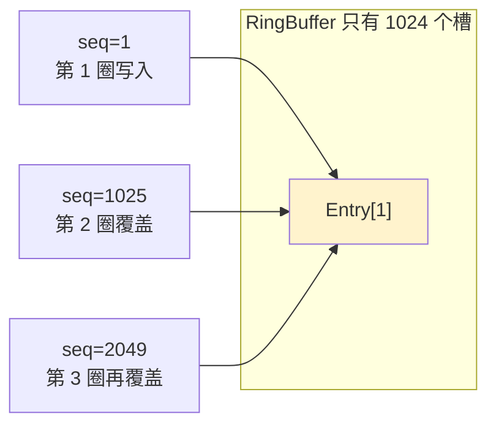
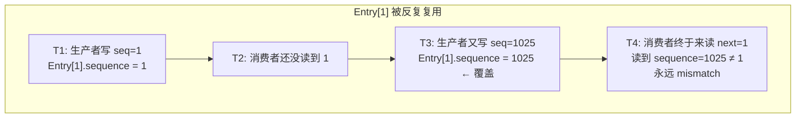
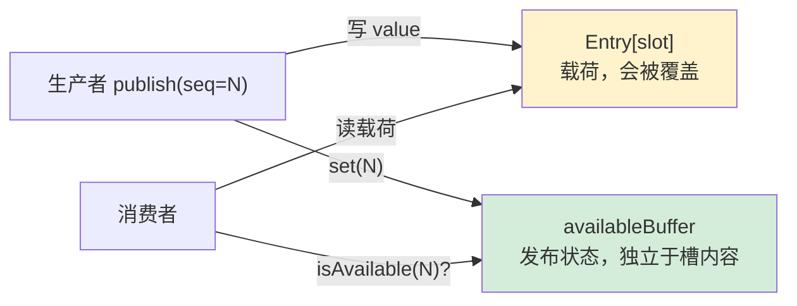
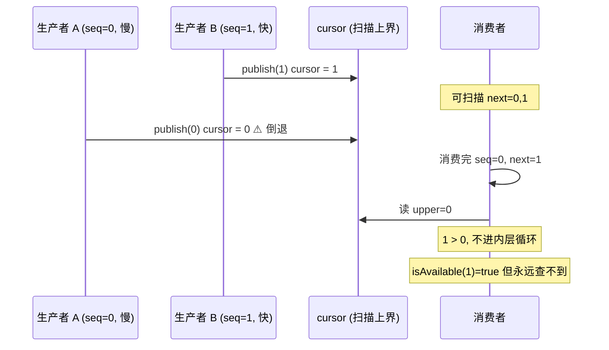
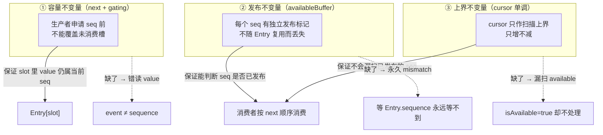

# Bug 诊断记录：多生产者 Demo "卡住" 与错读问题

> 配套代码：[`code/disruptor-lab/src/main/java/io/ddia/disruptor/lab/multiproducer/MiniMultiProducerDemo.java`](../../code/disruptor-lab/src/main/java/io/ddia/disruptor/lab/multiproducer/MiniMultiProducerDemo.java)
> 配套主文档：[`docs/mq-learning/Disruptor详解.md`](Disruptor详解.md)
>
> 诊断状态：**已修复并验证**。缺陷分两阶段：① `next()` 的 `do-while + continue` 绕环保护失效，未消费槽被覆盖；② 修正后 `publish` 仍用 `cursor.set(sequence)` 导致上界倒退，消费者漏扫已 available 的序号，环满后形成逻辑死锁。完整修复同时保证：容量保护正确、`availableBuffer` 发布可见、cursor 经 CAS 取 max 单调不回退。验证见第 14 节。

---

## 怎么读这份文档

| 目的 | 跳到 |
|---|---|
| 只想看结论与检查清单 | [第 12 节](#12-诊断与防御清单) |
| 想看可迁移的并发判定纲领 | [第 13 节](#13-并发问题的判定纲领) |
| 想看修复是否真的闭环 | [第 14 节](#14-修复闭环与验证) |
| 想跟完整排查过程 | 从第 1 节顺序读到第 11 节 |
| 想先搞懂「单调」「位图」为什么必须 | [第 2.5 节](#25-核心概念槽复用发布位图与-cursor-单调) |

---

## 目录

1. [现象描述](#1-现象描述)
2. [不是"残留进程"：是真正的算法缺陷](#2-不是残留进程是真正的算法缺陷)
2.5. [核心概念：槽复用、发布位图与 cursor 单调](#25-核心概念槽复用发布位图与-cursor-单调)
3. [根因分析：绕环保护失效导致 Entry.sequence 被覆盖](#3-根因分析绕环保护失效导致-entrysequence-被覆盖)
4. [验证：用日志复现问题](#4-验证用日志复现问题)
5. [第一次修复尝试：引入 availableBuffer 位图](#5-第一次修复尝试引入-availablebuffer-位图)
6. [JMM 可见性陷阱：为什么 long[] 不行要用 AtomicLongArray](#6-jmm-可见性陷阱为什么-long-不行要用-atomiclongarray)
7. [LMAX 原版思路对照](#7-lmax-原版思路对照)
8. [表面运行结果与遗留问题](#8-表面运行结果与遗留问题)
9. [二次验证：当前代码仍会错读数据](#9-二次验证当前代码仍会错读数据)
10. [当前修复后仍会卡住：cursor 倒退形成永久等待](#10-当前修复后仍会卡住cursor-倒退形成永久等待)
11. [为什么这个 bug 如此隐蔽](#11-为什么这个-bug-如此隐蔽)
12. [诊断与防御清单](#12-诊断与防御清单)
13. [并发问题的判定纲领](#13-并发问题的判定纲领)
14. [修复闭环与验证](#14-修复闭环与验证)

---

## 1. 现象描述

跑多生产者 demo 改小到 `perProducer = 5_000` 之后，程序**依然不结束、不打印最终统计**：

```bash
mvn -q -f code/disruptor-lab/pom.xml exec:java \
    -Dexec.mainClass=io.ddia.disruptor.lab.multiproducer.MiniMultiProducerDemo
```

看起来像是「上次跑剩的残留进程把这次卡住了」，但 `pgrep` 没有残留进程，**这是程序自己死循环**。

---

## 2. 不是"残留进程"：是真正的算法缺陷

> **结论先行：这不是 JVM 没清理干净也不是线程饥饿，而是多生产者的绕环保护没有真正挡住生产者，导致还没被消费者处理的槽位被后续序号覆盖。消费者再用 `Entry.sequence` 等老序号，就会永远 mismatch。**

证据：

1. 三个生产者线程都 `join()` 了，能跑出 `producer.join()` 说明生产者线程确实跑完了
2. 消费者在 `while (consumer.processed() < total - 1)` 里死等，但 `processed()` 永远追不上
3. 加日志后能看到消费者一直卡在 `next=1`、`published=149505` 这种值上，跟 `next` 完全对不上

「残留进程不会发生」是因为：

- Maven `exec:java` 是前台 fork 子进程跑 main，main 退出 JVM 就退
- 三个生产者都是 `setDaemon(true)`，主线程不退也会被强制终止
- `pgrep` 啥也搜不到

---

## 2.5 核心概念：槽复用、发布位图与 cursor 单调

后面几节的 bug 都绕不开三个概念。如果这里没想清楚，很容易把「症状」（卡住、错读）和「机制」（复用、单调、独立标记）混在一起。本节只讲**为什么必须这样设计**，具体哪行代码写错了见第 3、5、10 节。

### 2.5.1 环形队列在复用什么？

RingBuffer 的长度固定（本 demo `bufferSize=1024`），但消息序号从 `0, 1, 2, …` **无限递增**。槽位下标只靠取模：

```text
slotIndex = sequence & (bufferSize - 1)

seq=1     → Entry[1]
seq=1025  → Entry[1]    （同一物理槽，第 2 圈）
seq=2049  → Entry[1]    （第 3 圈）
```



**可以复用槽，但不能复用「还没被消费者处理完」的那一轮。** 容量保护（`next()` 里的 gating）管的就是这件事：生产者绕环前必须等消费者 cursor 推进，否则会把旧数据直接盖掉。

### 2.5.2 为什么复用槽时不能靠 Entry 判断「是否已发布」？

`Entry` 里同时存两样东西：

| 字段 | 语义 |
|---|---|
| `value` | 消息载荷 |
| `sequence` | 写入时记录的序号（也可当发布标记） |

槽被复用后，**后一圈写入会把 `Entry.sequence` 盖成更大的序号**。消费者若还在等 `seq=1`，去读 `Entry[1].sequence`，看到的可能是 `149505`——不是「1 还没发布」，而是「这个槽早被第 N 圈占用了」。



所以需要**第二套存储**：发布状态不能和会被复用的 `Entry` 绑死。这就是 `availableBuffer` / 位图存在的原因——它回答的是：

> **「序号 N 这一条，有没有发布完成？」**  
> 而不是「**这个槽里最后一次写的是几号？**」



**位图不是 LMAX 的唯一做法**（第 7 节：生产实现用 `int[]` 存轮次 flag）。本 demo 用单 bit 是教学简化；共同点是：**发布元数据和会被复用的数据槽分离。**

### 2.5.3 「单调」是什么意思？cursor 为什么必须单调？

这里说的**单调**（monotonic）指一个跨线程共享的数值**只增不减**：

```text
cursor 的历史:  -1 → 0 → 1 → 5 → 5 → 8 → …
                ✓ 可以相等（后发布的小序号被忽略）
                ✓ 可以跳增（中间有洞）
                ✗ 不能 8 → 3（倒退）
```

本 demo 里 `cursor` 的职责不是「`[0..cursor]` 全都已发布」（多生产者会有洞），而是给消费者一个**扫描上界**：

```java
long upper = seq.cursor();
while (next <= upper) {
    if (!available.isAvailable(next)) { /* 这一条还没发完，等 */ }
    else { /* 消费 next */ }
}
```

这段代码隐含一条契约：

| 条件 | 消费者的解读 |
|---|---|
| `next > upper` | 后面**暂时**没有值得检查的序号，先 park |
| `next <= upper` | 至少应该**进去查** `isAvailable(next)` |

**只有 `upper` 单调不回退，「next > upper ⇒ 不用查」才成立。** 若 `upper` 从 1 被写回 0：



这就是第 10 节卡死的根因：**不是 bit 没写上，而是倒退的 cursor 把已发布的序号挡在扫描范围外。**

`volatile` 保证这次写入**最终能被看到**，**不**保证多个线程写入后取 `max`——`set` 是覆盖，不是「原子地取更大值再写」。多生产者下必须用 CAS 实现 `cursor = max(cursor, sequence)`，或干脆让 publish 不碰 cursor（见第 7、14 节）。

### 2.5.4 三个概念如何一起工作

把三者叠在一起，正确的不变量是：



本 bug 的三层误判，正好对应三层不变量逐个失守又被「修症状」掩盖的过程（第 9.4、11.2 节）。

---

## 3. 根因分析：绕环保护失效导致 Entry.sequence 被覆盖

先把层次分清：

- **直接现象**：消费者等 `next=1`，但同一个槽里的 `Entry.sequence` 已经变成 `149505`，所以永远等不到 `1`
- **真正原因**：生产者本不该在消费者没跟上时继续绕环写同一个槽，但 `MultiProducerSequencer.next()` 里的容量保护写错了，导致生产者仍然 CAS 成功并继续申请新序号
- **设计问题**：简化 demo 又把 `Entry.sequence` 同时当作“槽里是哪条消息”和“这条 seq 是否已发布”的标记，一旦槽被复用覆盖，消费者就没有独立的发布状态可查（机制原因见 [2.5.2](#252-为什么复用槽时不能靠-entry-判断是否已发布)）

### 3.1 简化版多生产者的发布-消费约定

```java
// RingBuffer.publish()
Entry<T> e = entries[(int) (seq & sequencer.mask())];
e.value = value;
e.sequence = seq;                  // <-- 用 Entry.sequence 当"是否已发布"标记
sequencer.publish(seq);            // 推 cursor

// BatchEventProcessor.run()
Entry<T> e = rb.entries[(int) (next & seq.mask())];
long published = e.sequence;       // 读这个标记
if (published != next) {           // 还没发布到这一条
    LockSupport.parkNanos(1L);
    continue;
}
```

### 3.2 槽会被反复写

关键参数：

| 参数 | 值 |
|---|---|
| `bufferSize` | 1024 |
| `perProducer` | 50,000（修后） |
| `producerCount` | 3 |
| 总消息数 | 150,000 |

总共 150,000 条消息要写进 1024 长的环形数组，**每个槽平均会被写 150,000 / 1024 ≈ 146 次**。

`seq & 1023` 落在同一个 slot 上的所有 seq：

```
1, 1025, 2049, 3073, ... , 149505, ...
```

正常情况下，这些序号当然都会复用同一个槽，但**必须等消费者处理完旧序号以后才能复用**。环形队列不是不能覆盖，而是不能覆盖“还没被消费的旧槽”。

### 3.3 真正的算法错误：`continue` 没有阻止 CAS

`MultiProducerSequencer.next()` 里本来有绕环保护：

```java
wrapPoint = next - bufferSize;
if (wrapPoint > cached) {
    long min = minGating();
    if (wrapPoint > min) {
        Thread.onSpinWait();
        continue;
    }
    cachedGating.set(min);
    cached = min;
}
} while (!nextValue.compareAndSet(current, next));
```

它想表达的是：

> 如果 `wrapPoint > minGating()`，说明生产者申请的 `next` 已经要追上甚至越过消费者了，这个槽还不能复用。生产者应该等待，然后重新读取 `nextValue` 和消费者进度。

但这里有一个 Java 控制流陷阱：这段代码在 `do { ... } while (!CAS)` 结构里，`continue` 跳到的是 `while` 条件判断，而不是跳回 `do` 块开头。

所以执行路径实际上变成了：

1. 发现 `wrapPoint > min`，说明容量不够，应该等待
2. 执行 `continue`
3. 直接进入 `while (!nextValue.compareAndSet(current, next))`
4. 如果 CAS 成功，`next()` 返回这个本不该申请成功的序号

也就是说，容量保护虽然写在代码里，但在最关键的分支上没有生效。生产者会在消费者还没消费旧槽时继续把 `nextValue` 往前推，最终绕环覆盖还没处理的 `Entry`。

正确的逻辑应该确保“容量不足”这一轮**不会执行 CAS**，例如用普通 `while (true)` 循环并在容量不足时 `continue` 到循环开头，或者把 CAS 放在确认容量足够之后的分支里。

### 3.4 时序问题：消费者启动慢，读到覆盖后的值

假设三个生产者启动极快，消费者读完 cursor 时 cursor 已经是 `149999`：

1. 消费者从 `next=0` 开始处理
2. 处理到 `next=1` 时去读 `Entry[1 & 1023].sequence` = `Entry[1].sequence`
3. **因为 `next()` 的绕环保护失效**，后续生产者已经可以抢到 `1025`、`2049`、`3073` 这类本应等待消费者后才能复用的序号
4. 消费者读到的 `published = 2049`，而它要等 `published == 1`
5. 消费者 park、重读、再读、再 park...，**永远等不到 1**，因为 Entry[1] 已经被写到 `149505` 了

这里不需要假设某个生产者“还没来得及写 `seq=1`”。只要消费者落后、而生产者越过容量保护继续绕环，旧槽就可能被覆盖。`Entry.sequence` 被覆盖是结果，不是第一个出错点。

### 3.5 另一个语义问题：cursor 不能简单 `set(sequence)`

> 关于「单调」的定义、消费者为何依赖单调上界、以及 `volatile` 与单调的区别，见 [2.5.3](#253-单调是什么意思cursor-为什么必须单调)。

当前 `publish(sequence)` 还是：

```java
public void publish(long sequence) {
    cursor.set(sequence);
}
```

这在多生产者里也容易误导。多生产者的发布顺序可以和申请顺序不同：

```text
线程 A 抢到 10，还没发布
线程 B 抢到 11，先发布 cursor=11
线程 A 后发布 cursor=10
```

如果把 `cursor` 理解成“连续可消费到哪里”，那 `cursor=11` 是假的，因为 10 可能还没发布；如果后面又写回 `10`，`cursor` 甚至会倒退。

所以多生产者下需要分开两个概念：

- `nextValue` / claimed cursor：生产者最多已经申请到了哪个序号
- `availableBuffer`：每个具体序号是否真的发布完成

消费者不能只看一个 `cursor` 就认为 `[0..cursor]` 都可消费，必须结合 `availableBuffer` 找从 `next` 开始的连续可用区间。

这一节最初只是指出 cursor 的语义风险。后续把 `next()` 改成正确的 `while (true)` 容量保护后，这个风险成为当前版本仍然可能卡住的直接原因。完整的触发时序和永久等待链路见第 10 节。

### 3.6 日志铁证

```
[consumer] mismatch #299371000: next=1, published=149505 (slot idx=1)
```

- `next=1` —— 消费者处理的第一批消息里的第二条
- `published=149505` —— 该槽被写过的最后一个序号
- `slot idx=1` —— `Entry[1]`，`149505 & 1023 == 1`，确认是同一个槽

**这说明旧槽确实被覆盖了。更准确地说：`next()` 没有正确阻止生产者绕环覆盖未消费槽位，而消费者又依赖会被复用的 `Entry.sequence` 当发布状态，两个问题叠在一起导致卡死。**

---

## 4. 验证：用日志复现问题

为了科学地证明这个 bug 而不是靠猜，加了两类诊断日志：

1. **消费者侧**：

   ```java
   if (mismatchHitCount == 1 || mismatchHitCount % 1000 == 0) {
       System.err.printf("[consumer] mismatch #%d: next=%d, published=%d (slot idx=%d)%n",
               mismatchHitCount, next, published, (int) (next & seq.mask()));
   }
   ```

2. **main 侧硬超时**（10 秒）：

   ```java
   if (System.nanoTime() > deadline) {
       System.err.printf("[main] TIMEOUT after 10s. consumer.processed=%d, total-1=%d%n",
               consumer.processed(), total - 1);
       consumer.stop();
       return;
   }
   ```

### 4.1 跑原始版本（不带超时）

输出会这样：

```
[consumer] mismatch #299371000: next=1, published=149505 (slot idx=1)
[consumer] mismatch #299372000: next=1, published=149505 (slot idx=1)
... 一直刷
```

到时间用户看不到任何东西，因为 `mismatchHitCount % 1000` 命中频率太低，加上 `tail -80` 又把 stdout 截掉。

### 4.2 跑带超时版本（10 秒）

10 秒后强制退出，能看到卡死现场的 `next` 和 `published`，**直接证明消费者等的是旧序号，但槽位已经被后续序号覆盖**。再回看 `next()` 的控制流，就能定位到更底层的绕环保护失效。

---

## 5. 第一次修复尝试：引入 availableBuffer 位图

> 槽复用后为什么必须把发布状态从 `Entry` 拆出来、位图解决的是什么问题，见 [2.5.2](#252-为什么复用槽时不能靠-entry-判断是否已发布)。

当时的第一版修复思路是：参考 LMAX 真实实现，给每个 seq 配一个独立的"是否已发布"标记位，**这个标记位不会被 `Entry` 槽位复用覆盖**。

这个方向只对了一半。`availableBuffer` 确实解决了“发布状态不能放在 Entry 上”的问题；但它不能替代 `next()` 里的容量保护，也不能保证 ring slot 里的 value 仍然属于当前 sequence。真正完整的修复需要两件事：

1. `next()` 在 `wrapPoint > minGating()` 时必须等待，不能继续 CAS 申请序号
2. 发布状态使用 `availableBuffer`，消费者用它判断具体 `seq` 是否已经发布

### 5.1 数据结构

```java
static final class AvailableBuffer {
    final AtomicLongArray bits;
    AvailableBuffer(int capacity) {
        this.bits = new AtomicLongArray((capacity + 63) >>> 6);
    }
    void set(long seq) {
        int idx = (int) (seq >>> 6);
        long mask = 1L << (int) (seq & 63);
        while (true) {
            long old = bits.get(idx);
            long newV = old | mask;
            if (old == newV) return;
            if (bits.compareAndSet(idx, old, newV)) return;
        }
    }
    boolean isAvailable(long seq) {
        int idx = (int) (seq >>> 6);
        long mask = 1L << (int) (seq & 63);
        return (bits.get(idx) & mask) != 0;
    }
    void clear(long seq) {
        // CAS 清掉一位
    }
}
```

### 5.2 生产端加 set

```java
public void publish(T value) {
    long seq = sequencer.next();                 // CAS 抢序号
    Entry<T> e = entries[(int) (seq & sequencer.mask())];
    e.value = value;
    e.sequence = seq;
    available.set(seq);                          // ← 新增：在位图里打点
    sequencer.publish(seq);                      // 推 cursor
}
```

### 5.3 消费端查位图、不再读 Entry.sequence

```java
public void run() {
    long next = cursor.get() + 1;
    while (running) {
        long available = seq.cursor();
        while (next <= available) {
            // 不再读 e.sequence，改查位图
            if (!rb.available.isAvailable(next)) {
                LockSupport.parkNanos(1L);
                available = seq.cursor();
                continue;
            }
            Entry<T> e = rb.entries[(int) (next & seq.mask())];
            handler.onEvent(e.value, next, next == available);
            rb.available.clear(next);             // 处理完清掉位，避免内存膨胀
            cursor.set(next);
            next++;
        }
        if (next > available) {
            LockSupport.parkNanos(1L);
        }
    }
}
```

> 注意：`available.set(seq)` 必须发生在对消费者可见的发布信号之前，否则消费者看到上界推进后查位图可能查不到（见下一节 JMM 分析）。不过在多生产者里，这个“发布信号”不能简单理解成 `cursor.set(sequence)` 就等价于 `[0..sequence]` 全部可用。

---

## 6. JMM 可见性陷阱：为什么 long[] 不行要用 AtomicLongArray

第一版修复用的是普通 `long[]`，跑出来**不是永久死循环**而是**消费到一半卡死**：

```
[consumer] not-yet-available #131616000: next=773 (slot idx=773)
... 卡在 next=773
```

### 6.1 happens-before 链

消费者要查到 `seq=N` 的位，至少需要两个保证：

1. producer 写入 bit 后，consumer 能看到这个写入
2. 多个 producer 同时设置同一个 `long` word 里的不同 bit 时，不能互相覆盖

```
producer thread:                       consumer thread:
──────────────                         ──────────────
e.value = value;                       long available = seq.cursor();
e.sequence = seq;        ───?───      while (next <= available) {
available.set(seq);     ← 这里        if (!rb.available.isAvailable(next))
sequencer.publish(seq);  ← cursor 写                          ↑
                                       └── 这里能否看到 set(seq)？
```

`sequencer.publish(seq)` 内部是 `Sequence.set` = volatile 写。对单个生产者来说，`available.set(seq)` 写在 `cursor.set(seq)` 前面，consumer 如果读到了这次 volatile 写，按 release/acquire 语义可以看到之前的写。

但这个 demo 是多生产者，普通 `long[]` 还会遇到更直接的问题：设置 bit 是读-改-写，不是原子操作。

假设两个生产者同时设置同一个 `long` word：

```text
old = 0
producer A 要 set bit 1，算出 0b0010
producer B 要 set bit 2，算出 0b0100
A 写回 0b0010
B 写回 0b0100
```

最终 bit 1 丢了。消费者等 `seq=1` 时就会一直看到 unavailable。

### 6.2 实测结果

实际跑确实会出现「消费者读到 cursor 推进了但某个 bit 一直不可用」的情况。具体表现就是 `next=773` 卡住。这不一定只是缓存可见性问题，更可能是普通 `long[]` 的并发读-改-写丢了更新。

### 6.3 改用 `AtomicLongArray`

`AtomicLongArray.get/compareAndSet` 同时解决两个问题：

- CAS 保证多个 producer 设置同一个 word 的不同 bit 不会丢更新
- atomic/volatile 读写语义保证 producer 写入的 bit 对 consumer 可见

> **教训：跨线程共享的发布位图不能用普通 `long[]` 做非原子读-改-写，必须用 Atomic / VarHandle / Unsafe 这类带原子性和可见性保证的机制。**

---

## 7. LMAX 原版思路对照

真实的 LMAX Disruptor 里，多生产者发布追踪也叫 `availableBuffer`，但**不是位图**：

- 结构是 `int[]`，长度等于 ring buffer 容量
- 每个槽存的是**轮次 flag**：`flag = (int) (sequence >>> indexShift)`（`indexShift = log2(bufferSize)`）
- `publish(seq)` 把 `availableBuffer[seq & mask] = flag`
- `isAvailable(seq)` 判断该槽当前 flag 是否等于 `seq` 对应的轮次

因此 `seq=1` 与 `seq=1025`（`bufferSize=1024`）落在同一槽，但 flag 不同（第 0 圈 vs 第 1 圈），**天生区分第几圈，不依赖 clear**。

职责划分：

- `next()` / `tryNext()` 申请序号，并用 gating sequence 防止绕环覆盖未消费槽
- `publish(seq)` 只标记该 seq 已发布（写 flag），**不**用乱序的 `set(sequence)` 当连续上界
- 消费者结合 claimed cursor 上界与 `availableBuffer`，从 `next` 起找连续可消费区间
- `Entry.sequence` / `event.getSequence()` 用来**识别拿到的是哪条消息**，不是发布状态

### 7.1 本 demo 单 bit 方案的隐式不变量

本 lab 为简化用了 `AtomicLongArray` 位图：`seq=1` 与 `seq=1025` 映射到**同一 bit**。它能工作，完全依赖：

```text
容量保护（gating consumerCursor）
  + 消费者先 clear(next)、再 cursor.set(next)
  ⇒ 生产者写下一轮同槽时，上一轮 bit 一定已被清掉
```

若有人把 `clear` 挪到 `cursor.set` 之后，或破坏 gating，单 bit 会立刻错读。LMAX 的轮次 flag 没有这条隐式依赖。**不要把本 demo 的位图等同于生产级 LMAX 实现。**

我们最初把“是否已发布”和“是哪条消息”都压在 `Entry.sequence` 上，又叠加 `do-while + continue` 让绕环保护失效，才把覆盖问题暴露成永久卡住。

---

## 8. 表面运行结果与遗留问题

下面这段是当时引入 `availableBuffer` 后看到的运行输出。它只能说明程序没有再卡死，**不能证明消费到的数据正确**。

`perProducer = 50_000`，`producerCount = 3`，`total = 150,000`：

```
[consumer] processed 0
[consumer] processed 16384
[consumer] processed 32768
... (stdout 行因为超时侦测信号交错)

===== 多生产者 Disruptor 运行结果 =====
生产者线程数    : 3
消息总数        : 150,000 条
端到端耗时      : 47 ms
吞吐量          : 3.14 M ops/s

===== 对照单生产者 =====
publish() 次数 (volatile 写) : 146,402
CAS 尝试次数                 : 149,297  <-- 这里不为 0
CAS / 消息                   : 1.02

结论：多生产者路径上 CAS != 0，这是单生产者比多生产者快一个数量级的根本原因。
```

当时的数据点解读也需要修正：

- **publish() 次数 146,402 ≠ 150,000**：这个计数来自未同步的普通 `long` 字段，多个生产者并发自增会丢更新，因此不能拿它证明发布次数或消息完整性。
- **CAS / 消息 ≈ 1.02**：每条消息平均 1 次 CAS 抢号，是多生产者路径的最小理论下限（实际会比这个高）
- **3.14 M ops/s**：这个吞吐量只是“主循环推进到了结束条件”的结果。由于当时没有校验 `event == sequence`，它不能证明数据没有被错读。

不过这个结果只能说明 `availableBuffer` 路线缓解了 `Entry.sequence` 被覆盖后的等待问题，不能说明多生产者 sequencer 已经完全正确。完整版本仍应修正 `next()` 的绕环等待逻辑，并重新定义 cursor / availableBuffer 的职责。

---

## 9. 二次验证：当前代码仍会错读数据

后来重新检查时发现，第 5 节的 `availableBuffer` 修复仍然不完整。它解决了“消费者等 `Entry.sequence == next` 导致永久卡住”的问题，但没有解决更底层的覆盖问题：

> 生产者仍然可能在消费者读取旧槽之前绕环覆盖该槽。`availableBuffer` 只能说明某个 `seq` 曾经发布过，不能保证 ring slot 里现在还保存着这个 `seq` 对应的 value。

### 9.1 为什么原来的验证不够

当前 demo 的消费者只检查：

```java
if (event == null) {
    throw new IllegalStateException("消费到 null @ " + sequence);
}
```

这只能证明“读到的槽里有一个非空 value”，不能证明：

```text
正在消费 sequence=N 时，读到的 event 就是 sequence=N 对应的数据。
```

如果 `Entry[0]` 原本保存 `seq=0` 的数据，随后被 `seq=59984` 覆盖，那么消费者处理 `sequence=0` 时读到 `event=59984`，只要它不是 `null`，原 demo 仍然会继续运行，并打印出看似正常的吞吐结果。

这就是之前修复记录的问题：它把“程序不再卡死”误认为“算法已经正确”。

### 9.2 验证方式：让 event 直接等于 seq

为了验证数据是否真的有序，可以让生产者把申请到的 `seq` 本身写入 event：

```java
long seq = sequencer.next();
Entry<Long> e = ring.entries[(int) (seq & sequencer.mask())];
e.value = seq;
e.sequence = seq;
ring.available.set(seq);
sequencer.publish(seq);
```

消费者则严格检查：

```java
if (event == null || event.longValue() != sequence) {
    throw new AssertionError(
            "wrong event: sequence=" + sequence + ", event=" + event);
}
```

这个验证比“非空检查”强得多。因为只要消费者读到了被后续序号覆盖的槽，`event != sequence` 就会立刻暴露。

### 9.3 实测结果

用当前代码运行这个验证，很快失败：

```text
[consumer] not-yet-available #1: next=0 (slot idx=0)
java.lang.AssertionError: wrong event: sequence=0, event=59984
```

含义非常直接：

- 消费者正在按顺序处理 `sequence=0`
- 但它从 `Entry[0]` 读出来的 value 已经是 `59984`
- 说明 `Entry[0]` 在消费者读取 `seq=0` 之前，已经被后面的生产者绕环覆盖

所以当前代码虽然可能跑完，但它不是正确的多生产者 RingBuffer。

### 9.4 错误修复记录

这次 bug 实际经历了三层误判：

1. **第一层问题：卡死**
   - 原因被观察为 `Entry.sequence` 被覆盖
   - 消费者等待 `published == next`，但槽位已经变成后续序号

2. **第二层修复：引入 `availableBuffer`**
   - 这个修复让消费者不再依赖 `Entry.sequence`
   - 因此程序不再卡在 “等待旧 sequence” 上
   - 但它只证明某个 `seq` 曾经发布过，没有证明对应数据还在 slot 里

3. **第三层真因：容量保护失效**
   - `MultiProducerSequencer.next()` 在 `wrapPoint > minGating()` 时本应等待
   - 但 CAS 被放在 `do-while` 的 while 条件里
   - `continue` 会跳到 while 条件，仍然可能执行 `compareAndSet(current, next)`
   - 结果是容量不足时仍然可能申请新序号，生产者提前绕环覆盖未消费槽

准确结论：

> `availableBuffer` 是多生产者发布状态的一部分，但不是完整修复。完整修复必须先保证 `next()` 不会越过消费者 gating sequence，禁止生产者覆盖未消费槽；然后再用 `availableBuffer` 表示每个具体序号是否已经发布。

### 9.5 后续修复方向

`next()` 应改成更明确的控制流：容量不足时直接回到循环开头，不能执行 CAS。

示意：

```java
while (true) {
    long current = nextValue.get();
    long next = current + 1;
    long wrapPoint = next - bufferSize;
    long cached = cachedGating.get();

    if (wrapPoint > cached) {
        long min = minGating();
        if (wrapPoint > min) {
            Thread.onSpinWait();
            continue; // 重新读取 current / next / min，不执行 CAS
        }
        cachedGating.set(min);
    }

    if (nextValue.compareAndSet(current, next)) {
        return next;
    }
}
```

核心原则：

> 只有确认容量足够以后，才允许执行 CAS 抢号。

目前工作区中的 `MultiProducerSequencer.next()` 已经按这个原则改成 `while (true)`，因此旧版“容量不足仍执行 CAS”的控制流错误已经被修正。`publish(sequence)` 也已改为 CAS 取 max（见第 14 节）；第 10 节保留的是修复前的倒退分析，便于对照。

---

## 10. 当前修复后仍会卡住：cursor 倒退形成永久等待

### 10.1 修复前的剩余错误是什么

（本节描述的是 CAS 取 max 落地**之前**的状态；当前代码已修复，见第 14 节。）

当时 `MultiProducerSequencer` 把两个不同概念分成了两个字段：

- `nextValue`：生产者通过 CAS 抢号，表示目前最大申请到的序号
- `cursor`：每个生产者完成写入后，通过 `publish(sequence)` 写入的序号

申请序号的 `nextValue` 是单调递增的，但发布顺序不一定与申请顺序相同。当前发布代码却直接覆盖 cursor：

```java
public void publish(long sequence) {
    cursor.set(sequence);
    volatileWriteCount++;
}
```

`cursor.set(sequence)` 最终只是一次 volatile 写。volatile 能保证：

- 单次 long 写入不会被撕裂
- 其他线程最终能够看到这次写入
- 该写入之前的普通写不会被重排到它之后

但是 volatile **不能保证多个写线程写入的值只增不减**，也不会自动执行 `max(oldCursor, sequence)`。因此它在 Java 内存模型层面是可见的，在算法语义层面却仍然是错误的。

多生产者下完全可能出现：

| 时刻 | 生产者 A | 生产者 B | cursor |
|---|---|---|---:|
| T1 | `next()` 得到 0 |  | -1 |
| T2 |  | `next()` 得到 1 | -1 |
| T3 | 仍在填写槽位 0 | `publish(1)` | 1 |
| T4 | `publish(0)` | 已完成 | **0** |

T4 之后 cursor 从 1 倒退成了 0。写入本身没有丢失，`seq=1` 的 available 位也可能已经是 `true`；丢失的是“消费者应该继续向后检查”的上界信息。

### 10.2 为什么 availableBuffer 已经是 true，消费者仍然不处理

> cursor 单调性的图解推演见 [2.5.3](#253-单调是什么意思cursor-为什么必须单调)。

当前消费者不是无条件查询 `availableBuffer`，而是先读取 cursor，并把它作为扫描上界：

```java
long available = seq.cursor();
while (next <= available) {
    if (!rb.available.isAvailable(next)) {
        // 等待这个具体序号发布
        continue;
    }
    // 消费 next
}
```

这段逻辑隐含了一个关键不变量（即 [2.5.3](#253-单调是什么意思cursor-为什么必须单调) 的「上界不变量」）：

> cursor 必须是一个不会倒退的上界；只有这样，cursor 小于 next 才能表示“后面还没有任何值得检查的序号”。

一旦 cursor 倒退，这个不变量就失效。继续上面的例子：

1. `seq=1` 已经发布，`availableBuffer.isAvailable(1) == true`
2. 随后 `seq=0` 发布，把 cursor 从 1 写回 0
3. 消费者处理完 `seq=0`，令 `next=1`
4. 消费者重新读取到 `available=0`
5. `next <= available` 即 `1 <= 0` 为 false
6. 消费者根本进不了内层循环，因此没有机会调用 `isAvailable(1)`
7. 消费者不断 park、醒来、重读同一个 cursor=0，消费进度永久停在 0

确定性复现得到的状态是：

```text
producerCursor=0
consumerCursor=0
next=1 isAvailable=true
stalled=true
```

这里最关键的证据不是“bit 没有写进去”，而是 **bit 明明为 true，却被已经倒退的 cursor 挡在扫描范围之外**。所以继续修改位图的容量、原子性或 clear 逻辑，都不能解决这个卡住问题。

### 10.3 为什么会从消费者停顿发展成整个进程卡住

如果只是消费者暂时看到了一个较小的 cursor，后续还有生产者发布更大的 sequence，它可能再次被唤醒并继续推进。因此 cursor 倒退不一定每次都立即表现为永久卡死；它也可能只表现为偶发停顿。

真正的永久卡死发生在倒退后的 cursor 没有机会再被更大的发布值推进时。典型闭环如下：

```text
cursor 倒退到 next - 1
        ↓
消费者认为 next 超出发布上界，不检查已经为 true 的 available 位
        ↓
consumerCursor 停止推进
        ↓
RingBuffer 逐渐被生产者申请满
        ↓
next() 的绕环保护发现 wrapPoint > consumerCursor
        ↓
所有仍有消息要生产的线程都在 next() 中等待容量
        ↓
再也没有生产者能够完成一次更大的 publish 来抬高 cursor
        ↓
消费者等 cursor，生产者等 consumerCursor，形成永久循环等待
```

这不是传统的锁顺序死锁，因为代码没有互相持有两把锁；它是由两个进度条件互相依赖造成的**逻辑死锁**：

- 消费者继续前进的条件：生产者 cursor 至少推进到 `next`
- 生产者继续申请的条件：消费者 cursor 释放足够容量
- cursor 倒退后，双方都在等待对方先推进，但双方都已经失去推进路径

### 10.4 为什么 main 中的 10 秒超时可能完全没有输出

当前 main 的执行顺序是：

```java
for (Thread t : producers) {
    t.join();
}

long deadline = start + timeoutNs;
while (consumer.processed() < total - 1) {
    // 这里才检查超时
}
```

如果生产者已经因为 RingBuffer 满而卡在 `next()`，主线程会首先卡在 `t.join()`。它根本到不了下面的超时循环，所以所谓“10 秒硬超时”不能诊断这种生产者未结束的卡死。

这会带来两个容易误判的现象：

1. 没有打印 `TIMEOUT`，并不表示没有死锁；可能只是主线程还没越过 `join()`
2. 如果生产者只是运行很慢，等它们终于结束时 deadline 早已过期，主线程又会立即报超时，把“运行慢”误报成“消费者卡死”

因此超时监控必须覆盖生产者运行和 `join()` 阶段，不能放在所有 producer join 完成之后。

### 10.5 为什么新增验证显示通过，却没有发现这个错误

当前新增的 `VerifyMultiProducerFix` 只执行单线程顺序流程：

```java
long result = seq.next();
seq.publish(result);
```

在这个流程里，申请和发布严格按照 `0, 1, 2, ...` 发生，cursor 天然不会倒退。测试验证的是“申请序号是否连续”，没有验证多生产者最关键的乱序发布语义。

它还没有启动真实消费者，也没有检查下面这个卡死条件：

```text
consumerNext > producerCursor
&& availableBuffer.isAvailable(consumerNext)
```

所以 `ALL CHECKS PASSED` 只能证明顺序调用场景通过，不能证明多生产者实现正确。至少还需要覆盖以下确定性时序：

1. 先申请 `seq=0` 和 `seq=1`
2. 先发布 1，再发布 0
3. 断言 cursor 不得从 1 回退到 0
4. 启动消费者，断言它最终能连续消费 0 和 1

### 10.6 “真的死锁”与“只是很慢”要分开判断

当前 demo 配置为 3 个生产者，每个生产 5000 万条，总计 1.5 亿条消息；生产者和消费者等待时还频繁调用 `parkNanos(1L)`。在常见 Linux/JVM 环境里，`parkNanos(1)` 并不意味着线程只暂停 1 纳秒，实际调度开销可能远大于请求值。

因此运行很久不一定已经触发逻辑死锁。可以按进度区分：

- 日志里的 `processed` 仍持续增长：程序主要是运行慢，尚未卡死
- `processed` 长时间固定，且 `isAvailable(processed + 1) == true`、producer cursor 却小于这个 next：符合 cursor 倒退导致的卡死特征
- 生产者线程都停在 `MultiProducerSequencer.next()`，主线程停在 `Thread.join()`：说明逻辑死锁已经闭环

本次运行观察中，15 秒内消费者仍从 0 推进到了约 227 万，说明那一次短时间运行主要是在缓慢前进，而不是一启动就死锁。但 cursor 倒退可以通过固定发布顺序稳定复现，因此它仍是一个真实的正确性缺陷，只是触发永久等待需要特定线程时序。10.7 节把这个"阶段性"特征精确化成一个两阶段模型。

### 10.7 两阶段模型：从偶发停顿到永久卡死的转折点

10.6 节用"慢/死锁"的判断要点区分了两种现象，这里把它提炼成一个更精确的两阶段模型：cursor 倒退的危害不是一发生就永久卡死，而是先经历"偶发停顿"阶段，再在某个转折点固化成"永久卡死"。理解这个转折点，才能解释为什么这个 bug 在测试时如此难复现。

#### 10.7.1 阶段一：环未写满——cursor 跳动，消费者磕绊推进

`publish()` 是 `cursor.set(sequence)`，每次发布都是覆盖。只要还有生产者在继续发布，cursor 就会不断被新的 `set` 写入新值。由于多生产者发布顺序乱，cursor 会在不同生产者的 publish 之间来回跳：

```text
publish(1024) → cursor=1024
publish(500)  → cursor=500   （某个抢到 500 的生产者后写完）
publish(2000) → cursor=2000
publish(501)  → cursor=501   （又倒退）
...
```

在 cursor 跳到高值的那些瞬间，消费者是能被"救活"的。回到 10.2 节那个例子：cursor 倒退到 0、消费者停在 `next=1` 时，如果某个生产者随后 `publish(1024)` 把 cursor 设成 1024，消费者下一轮醒来读到 `available=1024 >= next=1`，就能进内层循环；而 `isAvailable(1)` 在最初 `publish(1)` 时就已经 set 成 true、从没被 clear 过（因为消费者此前从没成功消费过 `seq=1`），于是消费者顺利消费 `seq=1`，`next` 推到 2，继续往后。

所以在环未写满之前，cursor 倒退的症状是**吞吐偏低、偶尔卡某条 next、过一会又被后续 publish 救活**，而不是一卡就死。这解释了 10.6 节观察到的"15 秒内消费者仍从 0 推进到约 227 万"——它确实在前进，只是磕磕绊绊。

#### 10.7.2 阶段二：环写满——cursor 冻结，停顿固化成死锁

真正的转折点发生在 RingBuffer 被生产者申请满了的那一刻。此后再也没有 publish 发生，cursor 被冻结在某个值上，10.7.1 里那种"被后续 publish 救活"的机制失效，停顿就固化成永久死锁。

"环写满"有一个精确的判定条件。`next()` 的容量保护读的是 `consumerCursor`（gating sequences 里最小的那个），判定式是 `wrapPoint = next - bufferSize > consumerCursor`。代入数字（`bufferSize=1024`，消费者卡在 `consumerCursor=0`）：

```text
生产者能申请到的最大序号 = 1024
  next=1024 时 wrapPoint = 1024-1024 = 0，不大于 consumerCursor(0)，能申请
  next=1025 时 wrapPoint = 1025-1024 = 1 > consumerCursor(0)，必须等待
```

所以一旦消费者停在 `consumerCursor=0`，生产者最多只能把 `nextValue` 推到 1024，然后所有还有消息要发的生产者都会卡在 `next()` 的 `parkNanos` 上。这就是"环写满"的精确含义：

```text
nextValue - consumerCursor >= bufferSize
```

此时 10.3 节的闭环就合上了，而且具有**自持性**——几个进度条件首尾相接，每一个的满足都依赖环上它前面那个先满足：

```text
消费者推进        ←  需要  cursor 抬高到 >= next
cursor 抬高       ←  需要  有生产者执行 publish()
生产者 publish    ←  需要  先在 next() 里抢到号
生产者抢到号      ←  需要  consumerCursor 推进释放容量
consumerCursor 推进 ← 需要  消费者消费成功
                  ↑
              回到起点
```

没有任何线程持有锁，但所有线程都在等对方先动。这就是为什么 10.3 节强调它是"两个进度条件互相依赖造成的逻辑死锁"而非传统锁顺序死锁。

#### 10.7.3 两阶段对照

| 阶段 | RingBuffer 状态 | cursor 行为 | 消费者表现 |
|---|---|---|---|
| 偶发停顿 | 仍有空槽（`nextValue - consumerCursor < bufferSize`） | 后续 publish 不断 set，cursor 在高低值间跳动 | 磕绊推进，吞吐低，偶尔卡某条 next 后被救活 |
| 永久卡死 | 写满（`nextValue - consumerCursor >= bufferSize`） | 没有新 publish，cursor 冻结 | 卡在某个 next，consumerCursor 永不推进 |

#### 10.7.4 为什么这解释了 bug 的难复现性

两阶段模型直接解释了 10.6 节提到的"触发永久等待需要特定线程时序"：

- 如果测试消息量小、生产者很快发完就退出，环可能根本到不了写满状态，你只看到吞吐偏低，看不到卡死。
- 只有消息量足够大、消费者落后足够多、环真的被填满（`nextValue - consumerCursor >= bufferSize`）时，永久卡死才会稳定出现。
- 而"环写满"又依赖消费者先因 cursor 倒退而停顿足够久，这又依赖特定的发布乱序时序——这就是为什么它"可以通过固定发布顺序稳定复现"，但在自然并发下表现为偶发。

这也意味着，验证修复是否彻底时，光"跑完不卡"不够：消息量必须大到能撑满环、消费者必须慢到能落后一整圈，才能让阶段二真正被触发。10.5 节批评的那个顺序路径测试，连阶段一都进不去，自然无法暴露这个 bug。

### 10.8 正确修复需要恢复哪些不变量

这里先明确修复目标，不在诊断文档里混淆成某一段临时代码。正确实现至少要恢复三个不变量：

1. **容量不变量**：生产者不能申请会覆盖未消费槽位的序号；当前 `while (true)` 版 `next()` 已在修复这一点
2. **上界不变量**：消费者使用的 cursor 必须单调不回退
3. **发布不变量**：cursor 只表示扫描上界，具体 sequence 是否完成必须由带原子可见性的 available 状态判断

更接近 LMAX 的职责划分是：

- 在 `next()` 中用 CAS 单调推进 claimed cursor，作为消费者可扫描到的最大申请上界
- 在 `publish(sequence)` 中只标记该具体 sequence 已发布
- 消费者从自己的 next 开始，通过 available 状态寻找连续可消费区间

如果保留当前 `nextValue + published cursor` 的双字段设计，那么 published cursor 至少也必须通过 CAS 实现 `max(oldCursor, sequence)`，绝不能直接 `set(sequence)`。示意：

```java
public void publish(long sequence) {
    long cur;
    do {
        cur = cursor.get();
        if (sequence <= cur) return;        // 比当前上界还小，不写，避免倒退
    } while (!cursor.compareAndSet(cur, Math.max(cur, sequence)));
    volatileWriteCount++;
}
```

关键点：

- 用 CAS 而不是 `set`，保证"读-比较-写"是原子的，多个生产者并发 publish 不会互相覆盖
- `sequence <= cur` 时直接返回，后发布的小序号不会把 cursor 往回写
- `Math.max(cur, sequence)` 保证 cursor 只增不减

注意它**不改变发布顺序**：B 仍然可以先于 A 发布 `seq=1`，只是 A 后发布 `seq=0` 时发现 `0 <= 1`，直接返回，cursor 留在 1。乱序发布照常发生，但上界不再倒退——这正是 11.2 节"修原因不修症状"的体现：修的是"set 覆盖单调值"这个根因，而不是牺牲并发去消除乱序这个症状。

> **实现状态**：工作区已按上述 CAS 取 max 落地（见第 14 节）。下面保留示意代码便于对照诊断过程。

这条最小修补路径的优点是改动只集中在 `publish()` 一处、不破坏现有 `nextValue + cursor` 双字段结构；缺点是每次 publish 多一次 CAS（相比“publish 完全不碰 cursor、只用 claimed cursor 作上界”多了开销）。乱序发布、绕环、慢消费者和结束边界测试见第 14 节。

---

## 11. 为什么这个 bug 如此隐蔽

前面几节是在"逐层挖根因"，这一节换一个视角：为什么这个 bug 能在加日志、加测试、加超时、三轮复核的过程中反复骗过我们？把它当作一个隐蔽性案例来拆，比单纯记住"cursor 不能 `set`"更有迁移价值。

### 11.1 失败模式会伪装成成功

最危险的 bug 不是让程序崩溃的，而是让程序"看起来在正常运行"的。这个 demo 至少有三层伪装：

1. **程序能跑完**：第一层 bug 下程序卡死，但加 `availableBuffer` 后程序能跑完并打印统计——"跑完"这个事实会被潜意识等同于"正确"。
2. **打印了专业的性能数字**：`3.14 M ops/s`、`CAS / 消息 ≈ 1.02` 这类输出看起来像认真做过的基准测试，反而让人放下警惕。但这些数字只反映"主循环推进到了结束条件"，不反映消费到的数据是否正确。
3. **没有异常堆栈**：原 demo 消费者只检查 `event == null`，只要槽里有个非空值就继续。被覆盖的槽里几乎总会有非空值，所以不会抛异常。"没有红色报错 = 没问题"是人最常见的直觉。

### 11.2 每层修复都消除上一层症状，但不是根因

这是隐蔽性的核心来源，也是 9.4 节"三层误判"的实质：

```text
第一层：消费者卡在 mismatch
  ↓ 加 availableBuffer（消费者不再读 Entry.sequence）
第二层：程序不卡了，但数据被错读（event != sequence）
  ↓ 把 next() 改成 while(true)（阻止提前绕环覆盖）
第三层：覆盖没了，但 cursor 倒退让消费者卡在 next=1
```

每一层修复都"成功"了——上一层观察到的现象确实消失了。但每层修复都只解决了"上一层的症状"，没有解决"产生症状的根因"。更糟的是，**修复一个症状会让下一个 bug 变得沉默**：加 `availableBuffer` 后消费者不再报 mismatch，于是 `next()` 的控制流错误虽然还在，却失去了可见的报错去暴露它。

> 教训：一个"成功"的修复如果只是让现象消失，必须追问"我修的是症状还是原因"。

### 11.3 语法正确、读起来通顺的代码最危险

`next()` 的错误版本骨架是：

```java
do {
    ...
    if (wrapPoint > min) {
        Thread.onSpinWait();
        continue;          // 看起来在"等待"
    }
    ...
} while (!nextValue.compareAndSet(current, next));
```

这段代码编译通过、注释合理、读起来逻辑通顺——"容量不够就 `continue` 等一等"。只有把 Java 的 `do-while + continue` 控制流语义精确套上去，才会发现 `continue` 跳到的是 `while(...)` 条件判断而不是 `do` 块开头，于是 CAS 仍然会执行。

明显错误的代码活不到 code review；能活下来的都是"看起来对"的代码。这种"读起来通顺但语义错位"的控制流，比一个写错的公式难找得多——因为它不会触发任何工具告警，只能靠人脑逐行模拟控制流才能发现。

### 11.4 volatile 的语义错觉：可见 ≠ 单调 ≠ 原子 RMW

`publish()` 的错误只有一行：

```java
public void publish(long sequence) {
    cursor.set(sequence);   // volatile 写
}
```

`Sequence.set` 内部是 volatile 写。很多人记得"volatile 保证可见性"，就默认这行"安全"。但 volatile 只保证三件事（见 10.1 节）：不撕裂、最终可见、不重排。它**不保证**：

- 多个写线程写入的值单调递增（不会自动取 `max(old, new)`）
- 读-改-写是原子的（`set` 不是 CAS）

更隐蔽的是：**这行代码在单生产者下完全正确**。单生产者只有一个线程写 cursor，`set(sequence)` 天然单调。从单生产者 sequencer 复制粘贴到多生产者时，这行"一直没问题"的代码会带着它的正确性光环一起被搬过来，没人怀疑它。这是"正确上下文里的正确代码，搬到错误上下文里变成 bug"的典型，也是 3.5 节最初只把它当成"语义风险"而没有立即修复的原因。

### 11.5 测试通过本身就是一种伪装

`VerifyMultiProducerFix` 跑的是单线程顺序流程：

```java
long result = seq.next();
seq.publish(result);
```

申请和发布严格按 `0, 1, 2, ...` 顺序发生，cursor 天然不倒退。测试输出 `ALL CHECKS PASSED`，这个绿色信号会让人停止怀疑。

但多生产者最容易出错的恰恰是**乱序发布**：申请顺序 ≠ 发布顺序。测试覆盖的是"最不可能出错的顺序路径"，漏掉了"最可能出错的乱序路径"。10.5 节列出的最小复现用例（先申请 0 和 1，先发布 1 再发布 0，断言 cursor 不回退）正是针对这个盲区。

> 教训：验证多生产者 / 并发代码时，"顺序路径通过"几乎没有信息量，必须用能制造乱序时序的用例去打它。

### 11.6 诊断工具自身也有盲区

`main` 里的 10 秒超时检查放在所有 producer `join()` 之后（10.4 节）。如果生产者因为 RingBuffer 满卡在 `next()` 里，主线程会先卡在 `join()` 上，**根本到不了超时检查那一行**。

于是出现一个反直觉的现象：**"没打印 TIMEOUT" 不等于 "没死锁"**。我们加了一个本该兜底的诊断工具，但它的位置让它对最关键的那种死锁完全失明。更糟的是，它的存在会让人产生"有超时保护，不怕卡死"的安全感——诊断工具本身成了新的隐蔽层。

### 11.7 "很慢"和"卡死"难以区分

10.6 节指出：demo 配置成 1.5 亿条消息 + 频繁 `parkNanos(1)`，在普通环境下本来就慢。消费者 `processed` 还在涨时，可能是真的在慢跑，也可能是 cursor 倒退后又被某个迟到的 `publish` 临时救了一下、过几秒又会卡死。

要确认是 cursor 倒退型卡死，必须同时看三个量：

```text
processed 长时间不变
&& availableBuffer.isAvailable(processed + 1) == true
&& producerCursor < processed + 1
```

三个条件同时成立才是这种卡死。只看其中一个都会误判。这种"需要多个不变量交叉验证才能确认"的 bug，比一个直接抛异常的 bug 隐蔽一个数量级——它会让你在"是不是只是慢"和"是不是真的死了"之间反复摇摆，浪费大量排查时间。

### 11.8 隐蔽性的共性

把上面七点抽象一下，这个 bug 之所以隐蔽，是因为它同时利用了三类认知陷阱：

| 陷阱类型 | 具体表现 |
|---|---|
| **成功伪装** | 程序跑完、打印吞吐、无异常、测试绿色 |
| **语义错觉** | `continue` 看似等待实则放行；`volatile` 看似安全实则不单调；单生产者正确的代码搬到多生产者 |
| **工具盲区** | 超时检查位置错、测试覆盖错路径、单变量不足以判定卡死 |

任何一类单独出现都不难发现；三类叠加时，每一轮排查都会被"看起来没问题"的某个证据误导到错误方向，这就是为什么这个 bug 经历了三次误判才被完整定位。

---

## 12. 诊断与防御清单

把前面几节的教训浓缩成可操作的检查项，供后续写类似并发代码时对照。

### 容量保护

- [ ] `next()` 在容量不足时必须回到循环开头，**绝不执行 CAS**
- [ ] 容量保护逻辑用 `while(true) + continue`，不要用 `do-while + continue`（控制流陷阱）
- [ ] `cachedGating` 跨线程读写时必须是原子类型

### 发布与上界

- [ ] 多生产者 `publish()` 不能直接 `set(sequence)`，必须保证 cursor 单调（CAS 取 `max(old, sequence)`，或让 `next()` 的 claimed cursor 兼任扫描上界）
- [ ] 发布状态用独立的 `availableBuffer`，不要复用 `Entry.sequence`
- [ ] 跨线程位图用 `AtomicLongArray` / VarHandle，不要用普通 `long[]` 做非原子读-改-写

### 消费扫描

- [ ] 消费者扫描上界必须单调不回退
- [ ] 判断"具体序号是否已发布"必须查 available 状态，不能只看 cursor
- [ ] 严格按序消费，不要跳过

### 验证

- [ ] 消费者必须断言 `event == sequence`，不能只查 `event != null`
- [ ] 测试必须覆盖乱序发布（先申请 0/1，先发布 1 再发布 0）
- [ ] 测试必须启动真实消费者并断言它连续推进到结束
- [ ] "顺序路径通过"不能作为并发正确性的证据

### 诊断

- [ ] 超时监控必须覆盖 producer 运行和 `join()` 阶段，不能放在 join 之后
- [ ] 卡死判定要同时看 `processed`、`isAvailable(next)`、`producerCursor` 三个量
- [ ] "程序跑完"和"吞吐数字正常"都不能证明正确性，必须显式校验数据

---

## 13. 并发问题的判定纲领

前面 11、12 节是从这个具体 bug 提炼的隐蔽性分析和检查清单。这一节再往上一层，提炼一个判定纲领：什么时候一个并发设计需要提高警惕、必须显式保证不变量？

### 13.1 危险三元组

一个并发场景会出问题，当且仅当下面三个条件同时成立：

```text
并发危险 = 非原子操作 × 跨线程顺序依赖 × 共享可变状态
```

- **非原子操作**：一个逻辑操作由多个独立步骤组成，中间能被其他线程插入；或虽是单步但不是"读-改-写"整体原子（`set` 是原子写，却不是原子的"取 max 再写"）
- **跨线程顺序依赖**：业务要求某些步骤的可见顺序满足特定约束（单调、先后、连续、因果）
- **共享可变状态**：这些步骤读写的是跨线程共享、且会被修改的状态

三者缺一，危险就消失。所有并发修复的本质都是从三元组里消除至少一项：

| 消除哪一项 | 手段 | 本项目对应 |
|---|---|---|
| 非原子性 | 用 CAS / 锁把多步合成原子一步 | `publish()` 改 CAS 取 `max` |
| 顺序依赖 | 用独立标记解耦"顺序"和"数据" | `availableBuffer` 不再复用 `Entry.sequence` |
| 共享可变 | thread-local / immutable / 不复用 | 槽不复用就不会覆盖——但环形队列做不到 |

环形队列的结构注定了"共享可变状态"消不掉（槽就是要被复用），所以这个项目的修复只能从前两项入手——这也解释了为什么修复这么绕：不能简单地"不共享"，只能在"原子性"和"顺序保证"上反复打磨。

### 13.2 顺序依赖的四种形态

三元组里"非原子"和"共享可变"都比较显眼，唯独"顺序依赖"最隐蔽，因为它经常被"代码看起来是按顺序写的"这个假象掩盖。它在本项目里至少出现了四种形态，每种都对应一个具体 bug：

| 形态 | 含义 | 本项目的违反点 |
|---|---|---|
| 单调性 | 值只增不减 | `cursor` 被 `set(sequence)` 写回更小值 |
| 先后性 | A 必须在 B 之前对其他线程可见 | 原版靠 `Entry.sequence` 当发布标记，但槽被覆盖，"先填后标"的顺序丢了 |
| 连续性 | `[0..N]` 必须全部可用才能整体消费 | cursor 倒退让 `[next..available]` 出现空洞 |
| 因果性 | A 的写效果必须对读 B 可见 | 普通 `long[]` 位图 set 对消费者不可见/丢更新 |

这四种不是穷举，但覆盖了"顺序依赖"最常见的样子。判定一个并发设计是否有顺序依赖，可以逐项问：这里有没有要求"只增不减"、"先谁后谁"、"区间连续"、"谁的原因导致谁可见"？只要有一个"是"，就必须显式用某种机制（CAS、volatile、独立标记、内存屏障）去保证它，不能假设它自然成立。

### 13.3 纲领的可操作性用法

把 13.1 和 13.2 合起来，遇到一个并发设计时按这个流程自检：

```text
1. 这段操作是单步原子吗？
   否 → 进入 2
   是 → 仍要看这一步会不会破坏顺序（set 是原子但能破坏单调）

2. 这段操作跨线程共享可变状态吗？
   是 → 进入 3
   否 → 无危险

3. 业务对这段操作的可见顺序有依赖吗？
   有 → 逐项查四种形态：单调 / 先后 / 连续 / 因果
   无 → 无危险

4. 对每一种成立的形态，显式选择保证机制：
   单调 → CAS 取 max，或让天然单调的值兼任上界
   先后 → volatile 写做 release，或独立标记隔离顺序
   连续 → 上界单调 + 逐项 available 检查
   因果 → atomic / VarHandle 保证可见 + 原子读改写
```

### 13.4 关键原则

> **代码文本顺序 ≠ 跨线程可见顺序。** 只要一个值被多个线程读写、且业务要求它的可见顺序满足约束，就必须显式保证，并写测试去打那个乱序时序。

这正是本项目最大的教训：`publish()` 里 `cursor.set(sequence)` 在单线程里"按顺序写"，复制到多线程就倒退；`next()` 里 `do-while + continue` 读起来"在等待"，实际却在放行。代码的文本顺序骗了我们三轮，根本原因就是没有在"非原子 + 顺序依赖 + 共享可变"三元组成立时，显式去保证那个顺序不变量。

这个纲领的价值不在"记住三个名词"，而在把它变成一个条件反射：每当看到一段跨线程共享可变状态的代码，就问一句"这里有没有顺序依赖、有没有显式保证"。本项目三层误判的每一步，本来都可以在第一眼用这个问句拦下来。

### 13.5 治疗方向：三元组对应的三条路

13.1 说"消除三元组中任一项即可"，这里把三条路各自的具体手段列全。注意它们是"目标 × 手段"两层关系——保证顺序/原子化是目标，加锁/CAS 是手段，不要把目标和手段混为一谈。

#### 方向 A：消除非原子性（让多步不可分割）

让一个逻辑操作在跨线程视角下"要么全做完、要么没做"，中间不能被插入。

| 手段 | 机制 | 代价 |
|---|---|---|
| 锁（互斥） | 临界区串行化 | 阻塞、上下文切换、可能死锁 |
| CAS / 原子变量 | 无锁原子读改写 | CAS 失败重试、ABA |
| 组合写 | 多状态打包成不可变对象，`AtomicReference` 整体替换 | 对象分配、GC |

本项目的 `publish()` 改 CAS 取 `max` 就属于这一类的"CAS"手段；原版 `set` 之所以错，正是因为它是"原子写"但不是"原子的读-改-写"。注意这条路**不只有加锁**——Disruptor 的卖点就是无锁，靠的是 CAS。

#### 方向 B：消除顺序依赖（让业务不再要求特定可见顺序）

改变设计，让业务对"谁先谁后可见"不再敏感。这是最容易被忽略的一路，因为大家本能地想"怎么保证顺序"，而不是"能不能不要这个顺序"。

| 手段 | 做法 | 本项目对应 |
|---|---|---|
| 独立标记解耦 | 把"顺序状态"和"数据"分开存 | `availableBuffer` 不复用 `Entry.sequence` |
| 无序消费 | 消费者不要求按申请序，只要求"可消费" | LMAX 多消费者可并行 |
| 幂等 / 可交换 | 操作顺序可交换，结果相同 | 计数器自增、reduce |
| 结果合并 | 各线程独立计算，最后合并而非顺序叠加 | 分片 map-reduce |

本项目第一反应是去保证 `Entry.sequence` 的顺序（方向 A 思维），走了弯路才意识到可以用独立标记把顺序依赖解掉（方向 B）。先问 B 能避免很多不必要的锁。

#### 方向 C：消除共享可变（不共享或不变）

让多个线程根本不读写同一份可变状态，直接绕开整个三元组。

| 手段 | 做法 | 适用场景 |
|---|---|---|
| thread-local | 每线程独立副本 | 计数、临时缓冲 |
| immutable | 状态不可变，发布后只读 | 配置、快照 |
| copy-on-write | 读多写少时写时复制 | 监听列表、缓存 |
| 分片 / 分区 | 每线程独占一片，最后合并 | 分片计数、Disruptor 的"申请单点 + 写多槽" |

这一路在本项目用不了——环形队列的槽天生要被多线程复用，"共享可变"消不掉。但很多场景里这条路是最干净的：能用 immutable 就别用锁，能用 thread-local 就别共享。

#### 选路优先级：C → B → A

遇到顺序依赖问题，按这个优先级思考：

1. 先问**能不能不共享**（C，最干净，直接绕开三元组）
2. 再问**能不能解耦顺序**（B，次干净，不引入互斥）
3. 最后才问**怎么保证原子/顺序**（A，最重，要付出阻塞或 CAS 重试代价）

本能地直接跳到 A（"怎么加锁保证顺序"）是最常见的思维误区。先问 C/B 能避免很多不必要的锁和复杂度。

### 13.6 纲领与技巧的关系

"掌握思想纲领是不是比记加锁技巧重要很多"——方向对，但要精确：两者是"决策"和"执行"的关系，不是替代。

- **纲领决定治哪里**：三元组里消除哪一项、按 C→B→A 什么优先级选路。选错了，技巧再多也南辕北辙——本项目三轮误判就是有技巧（加日志、加测试、加超时）没纲领，每轮都在治症状。
- **技巧决定怎么治**：具体用 `ReentrantLock` 还是 CAS、`volatile` 还是 `AtomicLongArray`、怎么写不阻塞。纲领对了、没有技巧也落不了地。

所以是"**纲领优先，技巧支撑**"。记一百种锁的用法，不如先记住"遇到非原子 × 顺序依赖 × 共享可变就要问消除哪一项"——因为这一句能让你在第一眼就警觉，而技巧只有在你已经意识到要处理时才用得上。这也是为什么这份诊断记录把第 11–13 节放在具体修复之后：技巧已经在 1–10 节给过了，但真正能迁移到其他项目的，是最后几节的思想层。

---

## 14. 修复闭环与验证

第 1–13 节是验尸与纲领；本节证明**治愈有效**。

### 14.1 代码改动摘要

| 改动 | 作用 |
|---|---|
| `Sequence.compareAndSet`（`AtomicLongFieldUpdater`） | cursor 可做原子读-改-写 |
| `publish()`：CAS 取 max，`sequence <= cur` 直接返回 | 上界单调，乱序发布不倒退 |
| `next()`：保持 `while(true)`，容量不足不 CAS | 禁止覆盖未消费槽 |
| 消费者断言 `event == sequence` | 暴露错读，不再只查非空 |
| main 超时覆盖 `producer.join()` | 生产者卡在 `next()` 时也能打出 TIMEOUT |
| 计数器改为 `AtomicLong` | 避免并发自增丢更新误导吞吐解读 |

落地后的 `publish`：

```java
public void publish(long sequence) {
    volatileWriteCount.incrementAndGet();
    long cur;
    do {
        cur = cursor.get();
        if (sequence <= cur) {
            return; // 后发布的小序号不回写
        }
        casAttemptCount.incrementAndGet();
    } while (!cursor.compareAndSet(cur, sequence));
}
```

### 14.2 确定性乱序复现（修复前会失败的用例）

[`VerifyMultiProducerFix`](../../code/disruptor-lab/src/test/java/io/ddia/disruptor/lab/multiproducer/VerifyMultiProducerFix.java) 覆盖：

1. **顺序发号**：`next/publish` 连续
2. **乱序不倒退**：申请 0、1 → `publish(1)` → cursor=1 → `publish(0)` → cursor **仍为 1**
3. **消费者连续推进**：同上乱序后，真实消费者能消费到 `processed >= 1`
4. **并发 + `event==sequence`**：3 生产者 × 2000 条，全部通过

运行：

```bash
mvn -q -f code/disruptor-lab/pom.xml test-compile exec:java \
  -Dexec.classpathScope=test \
  -Dexec.mainClass=io.ddia.disruptor.lab.multiproducer.VerifyMultiProducerFix
```

实测输出：

```text
=== MultiProducer 修复验证 ===

Test 1: 顺序发放（不触发绕环）
  OK: 16 次 next/publish，序号连续 [0..15]
Test 2: 乱序发布不倒退 cursor
  OK: publish(1)→cursor=1，再 publish(0)→cursor 仍为 1（不倒退）
Test 3: 乱序发布后消费者连续推进
  OK: 先发 1 再发 0 后，消费者连续消费到 processed=1
Test 4: 并发生产 + event==sequence 校验
  OK: 6000 条全部消费且 event==sequence

ALL CHECKS PASSED
```

若把 `publish` 改回 `cursor.set(sequence)`，Test 2 会立刻报 cursor 倒退为 0；Test 3 会在 `isAvailable(1)==true` 却扫不到的状态下超时——这正是第 10 节的卡死特征。

### 14.3 Demo 端到端（带数据正确性校验）

```bash
mvn -q -f code/disruptor-lab/pom.xml exec:java \
  -Dexec.mainClass=io.ddia.disruptor.lab.multiproducer.MiniMultiProducerDemo
```

`perProducer=50_000`，3 生产者，共 150,000 条；生产者写入 `event=seq`，消费者断言相等。实测：

```text
===== 多生产者 Disruptor 运行结果 =====
生产者线程数    : 3
消息总数        : 150,000 条
端到端耗时      : 55 ms
吞吐量          : 2.69 M ops/s

===== 对照单生产者 =====
publish() 次数                  : 150,000
CAS 尝试次数                 : 309,766  <-- 这里不为 0
CAS / 消息                   : 2.07
```

要点：

- **能跑完**且 **`event==sequence` 全程成立**，才算正确（第 8/9 节曾把“跑完”误当成正确）
- `publish() 次数 == 150,000`：计数器已改为原子，不再因并发自增丢更新
- `CAS / 消息 ≈ 2`：含 `next()` 抢号 CAS + `publish()` 推 cursor CAS，高于“每条至少 1 次抢号”的下限是预期行为

### 14.4 修复后仍须记住的简化边界

- 单 bit `availableBuffer` 仍依赖第 7.1 节的隐式不变量；生产代码应优先考虑 LMAX 式轮次 flag
- 本修复走的是“保留 published cursor + CAS max”最小路径，不是唯一正确设计；也可用 claimed cursor 作扫描上界、publish 只写 available

---

## 附：改动的文件清单

| 文件 | 改动 |
|---|---|
| [`Sequence.java`](../../code/disruptor-lab/src/main/java/io/ddia/disruptor/lab/multiproducer/Sequence.java) | 新增 `compareAndSet`（`AtomicLongFieldUpdater`） |
| [`MultiProducerSequencer.java`](../../code/disruptor-lab/src/main/java/io/ddia/disruptor/lab/multiproducer/MultiProducerSequencer.java) | `next()` 用 `while(true)`；`publish()` CAS 取 max；计数器改 `AtomicLong` |
| [`MiniMultiProducerDemo.java`](../../code/disruptor-lab/src/main/java/io/ddia/disruptor/lab/multiproducer/MiniMultiProducerDemo.java) | `AvailableBuffer`；消费者查位图 + `event==sequence`；超时覆盖 join；单 bit 隐式不变量注释 |
| [`VerifyMultiProducerFix.java`](../../code/disruptor-lab/src/test/java/io/ddia/disruptor/lab/multiproducer/VerifyMultiProducerFix.java) | 顺序发号 + 乱序不倒退 + 消费者推进 + 并发 `event==sequence` |

> 当前状态：容量保护、发布标记、cursor 单调、数据校验与乱序测试均已闭环。后续若对照 LMAX，可把单 bit 换成轮次 flag，并评估“publish 不碰 cursor”的另一条职责划分。
