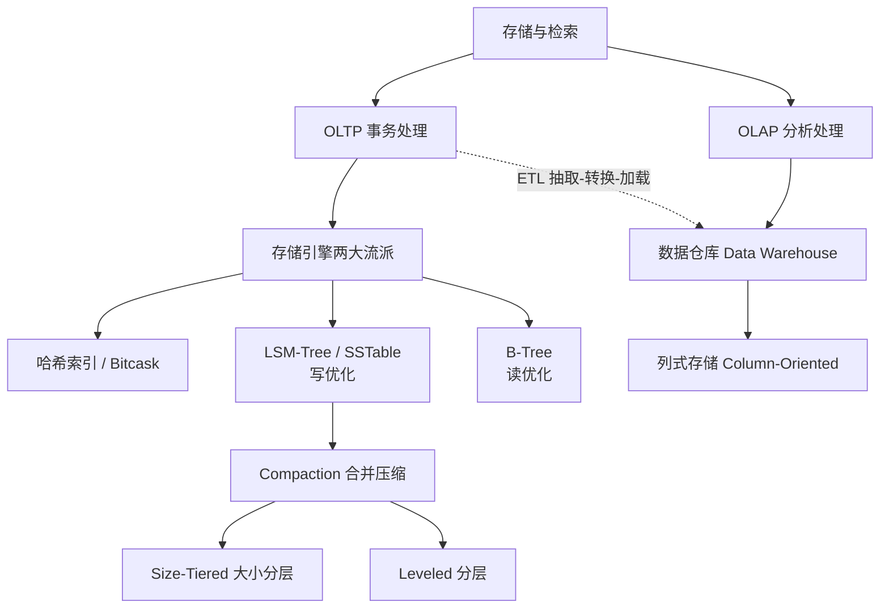
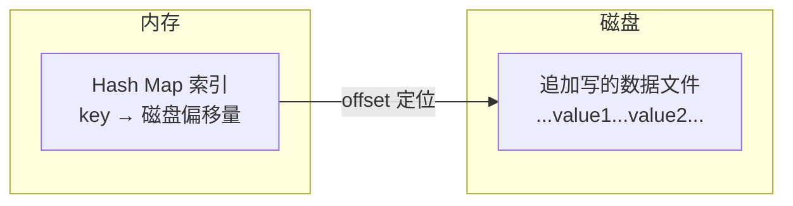
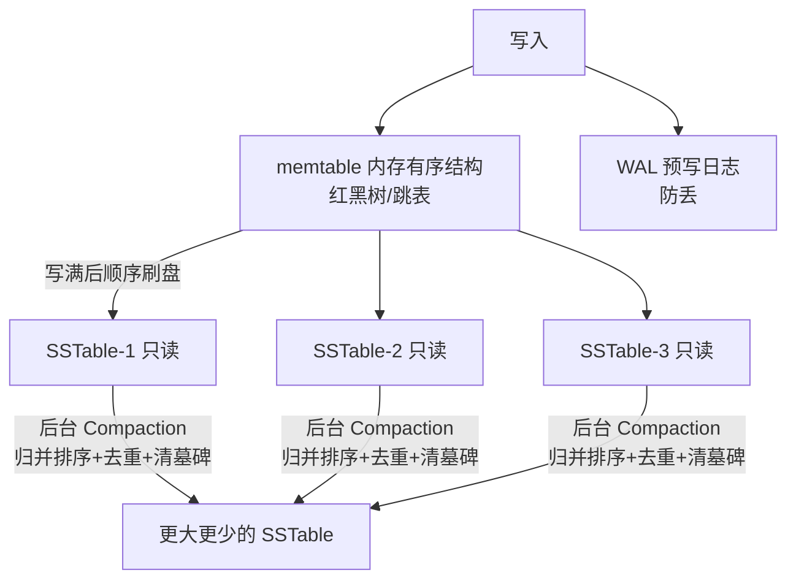
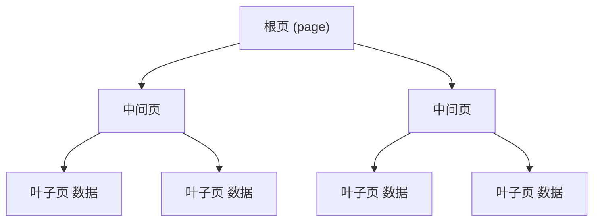
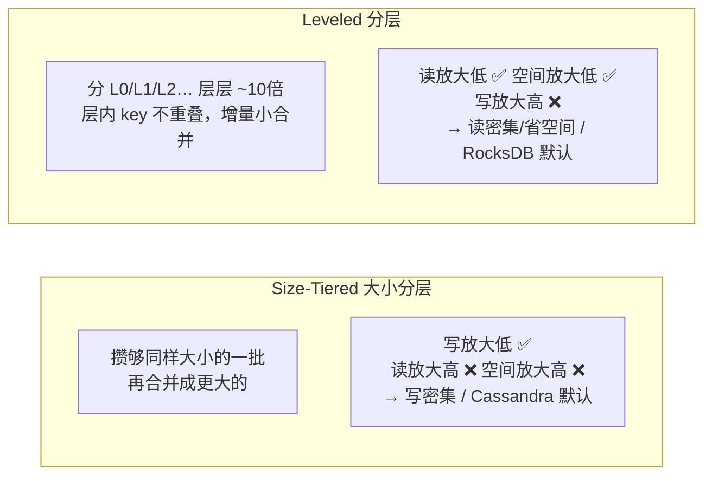
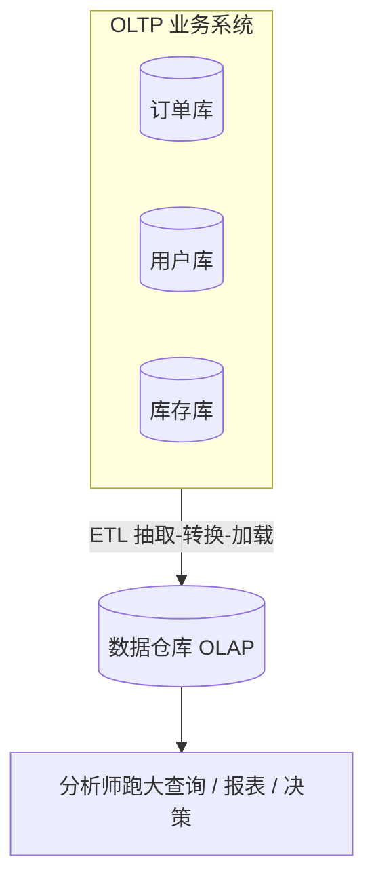
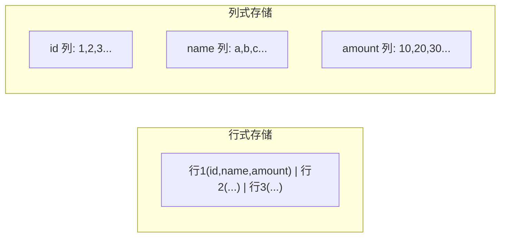

# DDIA 第 3 章：存储与检索（Storage and Retrieval）

> 核心问题：**数据库内部到底是怎么把数据存到磁盘、又怎么高效地查回来的？**
>
> 贯穿全章的主线：**根据不同的工作负载（读多 / 写多 / 分析），在「读性能、写性能、空间」之间做权衡（trade-off）。**

---

## 0. 全章脉络一览

---

## 1. 一个核心认知：顺序 vs 随机

理解整章的「钥匙」：

| | 随机访问 vs 顺序访问 |
|---|---|
| **内存（RAM）** | 几乎一样快（纳秒级），随机不吃亏 |
| **磁盘（HDD/SSD）** | **顺序快、随机慢**，可差几个数量级 |

> 几乎所有存储结构的设计，都是为了**迎合磁盘「顺序快、随机慢」的物理特性**。

**推论**：哈希表依赖「把 key 打散到随机位置」，这在内存里高效，在磁盘上每次查找都是昂贵的随机 I/O —— 所以**哈希索引只能放内存**，磁盘上要用有序的 B-Tree / LSM-Tree。

---

## 2. 索引的本质与权衡

- **索引**是从主数据「派生」出来的**额外的有序结构**，本身不改变数据，只改变查询性能。
- **读取**：从「全表扫描 O(n)」变成「直接定位 O(log n) / O(1)」→ **显著加快读取**。
- **写入**：每改一行，**所有相关索引都要同步更新**（写放大 + 维护有序结构的随机 I/O）→ **显著拖慢写入**。

> 本质：**用「写变慢」换「读变快」**。所以不会给所有字段都建索引。

---

## 3. 哈希索引（Hash Index / Bitcask）

- 值（value）追加写在磁盘文件；**key → 偏移量**的哈希表放在**内存**。
- **限制**：
  1. 所有 key 必须装进内存 → 不适合海量 key。
  2. key 被打散无序 → **不支持高效范围查询**。

---

## 4. LSM-Tree / SSTable（写优化）

**SSTable**（Sorted String Table）：按 key 排序、写好后只读不改的磁盘文件。
**LSM-Tree**：用很多 SSTable + 内存表 + 合并机制组成的存储引擎。

代表：LevelDB、RocksDB、Cassandra、HBase。

- **核心**：从不原地改，只「**追加 + 后台合并**」。
  - 更新 = 追加新记录（合并时新值覆盖旧值）。
  - 删除 = 追加「墓碑 tombstone」标记（合并时真正清除）。
- **写**：随机写 → 顺序写，**写吞吐高**。
- **读**：一个 key 可能散落多个 SSTable，**要查多个文件较慢** → 用 **布隆过滤器（Bloom Filter）** 快速排除不存在的 key。

---

## 5. B-Tree（读优化）

代表：MySQL InnoDB、PostgreSQL 等几乎所有传统关系库。

- 数据组织成固定大小的**页（page，通常 4KB）**，按 key 有序。
- **写**：找到 key 所在页**原地（in-place）修改**；页满则**分裂（split）** → **随机写**。
- **读**：一个 key 只在一个确定位置，**读路径稳定、可预测、通常更快**。

---

## 6. LSM-Tree vs B-Tree 对比

| 维度 | B-Tree | LSM-Tree (SSTable) |
|---|---|---|
| 写入方式 | 原地更新 → **随机写** | 追加 + 顺序刷盘 → **顺序写** |
| 写性能 | 较低 | **更高** |
| 读性能 | **稳定、通常更快** | 可能查多文件 + compaction 毛刺 |
| 空间 | 有页碎片/留白 | 压缩好、更紧凑 |
| 事务/锁 | **天然好做** | 较复杂 |
| 适用 | 读多写少、强一致/事务（OLTP） | 写密集（日志、时序） |

> 本质：**「读优化 vs 写优化」同一权衡的两种取舍。**

---

## 7. Compaction 合并压缩策略

**三个放大（评价标尺，不可能同时最优）**：

- **写放大**：一份数据被重写多少次（影响写性能、SSD 寿命）
- **读放大**：查一个 key 要看多少文件（影响读性能）
- **空间放大**：实际占用 ÷ 有效数据（影响磁盘成本）

| | Size-Tiered | Leveled |
|---|---|---|
| 写放大 | 低 ✅ | 高 ❌ |
| 读放大 | 高 ❌ | 低 ✅ |
| 空间放大 | 高 ❌ | 低 ✅ |
| 适合 | 写多读少 | 读多 / 省空间 |
| 代表 | Cassandra、HBase | LevelDB、RocksDB |

---

## 8. OLTP vs OLAP

| 维度 | OLTP（在线事务处理） | OLAP（在线分析处理） |
|---|---|---|
| 目的 | **支撑业务实时运转** | **从海量数据挖洞察、辅助决策** |
| 操作 | 增删改查**单条**记录 | 大范围**扫描 + 聚合**（SUM/GROUP BY） |
| 数据量/次 | 少（几条） | 巨大（百万行的少数列） |
| 延迟 | 毫秒级 | 秒~分钟级可接受 |
| 并发 | 高（海量用户） | 低（少数分析师） |
| 使用者 | 终端用户 / 应用 | 分析师 / 决策者 |
| 存储 | 多为**行式** | 多为**列式** |
| 代表 | MySQL、PostgreSQL | Snowflake、Redshift、ClickHouse |

**联系**：两者是**上下游**而非对立。OLAP 数据通过 **ETL** 从各 OLTP 库抽取汇总而来；单独建数据仓库是为了**让分析的重查询不拖垮在线业务**。

---

## 9. 列式存储（Column-Oriented Storage）

- OLAP 查询特点：**扫描海量行，但只用其中几列**。
- **行存**：取一列也要把每行所有列读出来 → 浪费。
- **列存**：同一列连续存放 → 只读需要的列、跳过其余 → 大幅减少 I/O；同列数据类型相同、**压缩率极高**（列压缩，如位图编码、游程编码）。

---

## 10. 一句话总结

> 第 3 章讲透了「**单机视角下数据如何存储与检索**」：用「顺序 vs 随机」这把钥匙，理解为什么哈希索引只能在内存、磁盘上要用有序的 B-Tree（读优化，原地更新）或 LSM-Tree（写优化，追加+合并）；compaction 在「写/读/空间」三个放大间取舍；最后从存储引擎上升到系统用途——OLTP（行存，支撑业务）与 OLAP（列存，辅助决策）通过 ETL 构成上下游。**核心永远是：根据工作负载做权衡。**

---

## 复习自测

1. 为什么哈希索引必须放内存？（提示：随机访问 + 磁盘特性）
2. 索引为什么加快读、拖慢写？
3. LSM-Tree 如何把随机写变成顺序写？读为什么可能慢、怎么优化？
4. B-Tree 和 LSM-Tree 各偏向读还是写？为什么？
5. Size-Tiered 和 Leveled compaction 各自牺牲了哪个「放大」？
6. 为什么 OLAP 用列式存储？它和 OLTP 是什么关系？
