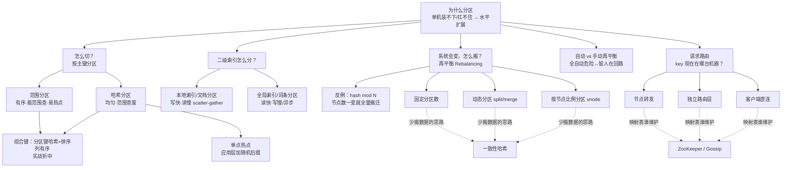
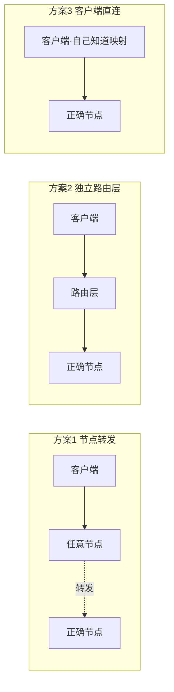

# DDIA 第 6 章：分区（Partitioning）

> 核心问题：**当数据量大到单机装不下、负载高到单机扛不住时，如何把一个大数据集拆散到多个节点上，实现水平扩展（scale out）？**
>
> 贯穿全章的主线：**一切设计都在追求「均匀（balanced）」，而「均匀」总在和「有序 / 高效查询 / 简单运维」相互拉锯 —— 没有银弹，只有权衡（trade-off）。**
>
> 本笔记按「一步步理解」的顺序组织，保留了关键比喻、数字推演和易错点澄清。

---

## 0. 全章脉络一览



---

## 1. 分区是什么：从「为什么会出现」理解

### 1.1 它解决的具体场景

想象一张表有 100 亿条用户记录、共 10 TB。两个现实问题：

1. **一台机器的硬盘装不下**（或装得下但太贵）。
2. 就算装得下，**所有读写都打到这一台**，CPU / 内存 / 磁盘 IO 也扛不住。

很自然的办法：把记录拆成若干堆，分别放到不同机器：机器 A 放用户 0~10 亿，机器 B 放 10~20 亿……

> **这个「把一个大数据集，切成互不重叠的小块，分别放到不同节点」的动作和结果，就是分区。** 每一小块叫一个分区。

### 1.2 精确含义（三个缺一不可的点）

1. 拆分的对象是**一个逻辑上的整体**（一张表、一个集合）。
2. 每条数据**只属于一个分区**，分区之间**不重叠**。
3. 不同分区放在**不同节点**上。

```
一条数据 → 属于某一个分区 → 这个分区位于某一个节点
```

### 1.3 理清含义的钥匙：和「复制」分开

模糊的根源往往是把分区和复制混在一起。

| | 复制（Replication，第5章） | 分区（Partitioning，第6章） |
|---|---|---|
| 做的事 | 把**同一份**数据复制多份 | 把**不同**数据切开分散 |
| 每个节点上是 | 全量数据的**一个副本** | 全量数据的**一部分** |
| 解决 | 容错、高可用、读扩展 | 存储/负载的**水平扩展** |

> **判断口诀**：问「机器 A 和 B 上的数据**一样吗**？」 —— 一样 → 复制（A 是 B 的副本）；不一样、各管一摊 → 分区。

### 1.4 现实中两者结合使用

分区和复制**不是二选一**，真实系统几乎总是一起用：先把数据分成若干分区，再给每个分区各做多个副本。

```
P1、P2、P3 三个分区，每个再复制 2 份：
  节点1: P1(主)  P3(副)
  节点2: P2(主)  P1(副)
  节点3: P3(主)  P2(副)
```
既能水平扩展（靠分区），又能容错（靠复制）。本章默认你已懂第5章复制，讲解时常把复制放一边、只聚焦分区这一维。

### 1.5 术语别名（看到都翻译成「分区」）

Shard / Sharding（MongoDB、ES、MySQL 分库分表）、Region（HBase）、Tablet（Bigtable/Spanner）、vnode（Cassandra/Riak）、Partition（Kafka、Druid、本书）。

---

## 2. 节点与分区的关系（务必钉死）

- **节点（Node）** = 一台运行数据库程序的服务器（**机器单位**）。脑子里直接换成「一台服务器」即可。
- **分区（Partition）** = 切开后的一小块数据（**数据单位**）。

> **比方**：分区 = 一**箱**货；节点 = 一个**仓库**。货箱要放进仓库，**一个仓库能放好几箱**。

### 关系是「一对多」，且数量不必相等

```
       节点1(服务器)              节点2(服务器)
      ┌──────────────┐         ┌──────────────┐
      │ P1  P2  P5   │         │ P3  P4  P6   │
      └──────────────┘         └──────────────┘
   6 个分区，2 个节点，每台放 3 个
```

> **关键认知：分区数和节点数是两回事！** 可以有 1000 个分区却只有 10 个节点（每节点 100 个）。这正是再平衡的精髓。

### 再平衡 = 搬「箱子」

加机器 = 新开一个空仓库，从原仓库各搬几箱过去，让各仓库货量相当：
```
   加节点3 前:              再平衡后:
   节点1: P1 P2 P5          节点1: P1 P2
   节点2: P3 P4 P6     →    节点2: P3 P4
   节点3: (空)             节点3: P5 P6  ← 从1、2各搬来一箱
```
注意：**只改「分区住在哪个节点」，不改「key→分区」的映射，也不动分区内部数据。**

> **「分区」这层的真正价值 = 解耦缓冲层**：把「数据怎么切」（稳定）和「数据放哪台机器」（灵活）分开。这是整个分区+再平衡设计的灵魂。

---

## 3. 目标与困境：一切为了「均匀」

- **目标**：靠加机器线性扩展 —— 10 台机器能处理约 10 倍于 1 台的数据和吞吐。
- **致命前提：必须均匀。** 系统整体能力不由最闲的节点决定，而由**最忙的那个节点**决定（木桶效应）。
  - **偏斜（Skew）**：负载分布不均。
  - **热点（Hot Spot）**：承受不成比例负载、被打爆的那个分区/节点。

> 设想 10 台机器但 90% 请求打到 1 台：这台先崩，另 9 台再闲也没用 —— 花 10 台的钱只得到约 1 台的有效能力。所以目标精确说是「**均匀地**分散，避免偏斜和热点」，否则扩展性是假的。

**困境的根源**：均匀和别的好处互相打架 ——
1. 想范围查询高效 → 数据要挨在一起（有序）→ 恰恰最易造热点。
2. 想彻底打散避热点（哈希）→ 把挨一起的数据打散 → 范围查询废。
3. **天生热点**：业务本身不均（明星账号），算法层无能为力。
4. 系统是**活的**（数据增长、节点增减）→ 要不停再平衡，而搬数据本身有代价。
5. 数据散开后，请求**怎么找到**正确节点（路由）。

---

## 4. 怎么切（按主键分区）

切法本质 = 回答「**给定一个 key，它该去哪个分区？**」这个从 key 到分区的映射规则。切的都是**主键**。

### 4.1 范围分区（Key Range Partitioning）

按 key **本身的顺序**切成连续区间，像**字典/百科全书分卷**（A–C、D–F…）。

```
P1: a~f   P2: g~m   P3: n~t   P4: u~z
查 "kevin" → 落 g~m → 去 P2
```
- **边界不机械均分**：名字以 a/s/m 开头的多、x/z 少，按数据实际分布选边界，可人工设或自动调。
- ✅ **范围查询高效**：同区间 key 有序挨在一起，「查 a~c 开头的所有用户」只访问 P1 顺序扫描。典型：传感器数据用时间戳做 key，查「某天 9–10 点的读数」直接扫一段。
- ❌ **易热点**：还是时间戳例子 —— 所有新写入时间戳都是「现在」，100% 写流量砸到 `P_now` 一个分区。
  - **补救**：key 前面拼别的字段，如 `传感器名 + 时间戳`，不同传感器落不同分区，写入分散；代价是查「所有传感器某时段」要对每个传感器各做一次范围查询。又是权衡。

### 4.2 哈希分区（Hash Partitioning）

动机：既然「有序」是热点根源，干脆**故意打破顺序** —— 用哈希函数打散。
```
key="kevin" → hash → 0x8F3A...  落某分区
key="kevon" → hash → 0x12B7...  落另一分区（名字很像也无妨）
```
- 哈希特点：输入差一点，输出天差地别、均匀铺满取值空间 → 即便原始 key 很倾斜也变均匀。
- **工程细节**：不需加密级（不用 MD5/SHA）；但同一 key 在所有节点必须算出**同值** —— 有些语言内置 hash 对同一字符串带随机种子返回不同值，**那种不能用**。
- ✅ **负载均匀**。
- ❌ **范围查询能力丧失**：相邻 key 散落各处 → 要么发到所有分区执行（早期 MongoDB），要么干脆不支持主键范围查询（Riak、Couchbase、Voldemort）。

### 4.3 组合键（实战折中，Cassandra）

```
主键 = (分区键, 排序列)
        ↑只对这部分哈希   ↑这部分在分区内有序
```
- 例 `(用户ID, 更新时间)`：不同用户被哈希打散到各分区（均匀）；同一用户数据在同一分区且按时间有序 → 查「某用户某时段动态」很高效。
- **鱼和熊掌各一半**：跨用户均匀 + 单用户内有序。DynamoDB（分区键+排序键）同理。

### 4.4 哈希也救不了的「单点热点」

> 哈希只对**不同的 key**有效。同一个 key 被疯狂访问（明星发微博，百万人读同一条）：它的哈希值固定 → 永远落同一分区 → **哈希再好也救不了**。截至本书**无自动方案**。

- **应用层补救**：给热点 key **加随机后缀**（拼 0~99，一个 key 拆成 100 个分散到不同分区）；代价是读要把 100 个 key 全读再合并、且要额外记录哪些 key 被拆过。只对**少数已知热点**用，不能无脑全局。又是「用读的复杂度换写的均匀」。

| | 范围分区 | 哈希分区 |
|---|---|---|
| 数据有序 | 有序 | 无序（打散） |
| 范围查询 | ✅ 高效 | ❌ 低效/不支持 |
| 负载均匀 | ❌ 易热点 | ✅ 较均匀 |
| 典型 | HBase、Bigtable | 早期 MongoDB hashed |

### 4.5 生产中实际用哪种？

> **默认首选哈希**（防热点，心智负担小、出事概率低）；**有范围查询需求才上范围分区**（时序/监控/顺序扫描，且仍要主动设计 key 打散写入）。

但真实系统多是**变体/组合**，不是教科书纯种：

| 系统 | 实际策略 |
|---|---|
| Cassandra / ScyllaDB / DynamoDB | **组合键**：分区键哈希 + 排序列有序（事实标准） |
| HBase / Bigtable | 范围分区（Region/Tablet）+ 预分区/rowkey 加盐对抗热点 |
| MongoDB | 两种都支持，让你选（hashed vs ranged） |
| Elasticsearch | 对 `_id` 哈希 |
| Redis Cluster | 16384 哈希槽（固定分区的哈希变体） |
| Kafka | 消息按 key 哈希到固定 partition |
| MySQL/PG 分库分表 | 多数哈希（取模/一致性哈希），少数按日期范围 |

> 主流规律：**「哈希做大方向保证均匀，再叠加一个有序维度满足范围查询」。** 而哈希的实现又牵出「一致性哈希 / 固定分区数」（见第 6 节再平衡）—— 真正用的从不是简单的 `hash mod N`。

---

## 5. 二级索引的分区

**难题**：前面切的都是主键，按主键查没问题。但常需按**非主键**查（汽车库里「所有红色的车」「2020 款」）。「红色的车」可能分布在**所有分区**（车辆 ID 与颜色无关），那「颜色→车辆」这个索引本身怎么在各分区间存放？

### 5.1 本地索引（Document-partitioned / Local Index）

**核心：每个分区只为自己分区内的数据维护索引，各管各的。**
```
分区0(车 0~499)            分区1(车 500~999)
  数据 + 本地索引            数据 + 本地索引
  红→[本分区的红车]          红→[本分区的红车]
```
- ✅ **写快**：新车落哪个分区就只更新那个分区的索引，只碰一个分区。
- ❌ **读慢（scatter/gather）**：查「红色」要**问遍所有分区再聚合**；即使只有一个分区有结果也得全问；延迟取决于**最慢的分区**。但依然被广泛使用。
- 用：MongoDB、Elasticsearch、Cassandra、Riak、VoltDB（大多数系统默认）。

### 5.2 全局索引（Term-partitioned / Global Index）

**核心：建一个覆盖全数据的索引，并按「索引词条(term)的值」来组织和分区。**
```
索引分区A(颜色 a~r)        索引分区B(颜色 s~z)
  红→[全数据集所有红车，      ...
      无论数据存哪个分区]
```
- ✅ **读快**：「红色」只在一个索引分区，直接命中，**无需 scatter/gather**。
- ❌ **写慢/复杂**：写一辆红车时，数据在分区X 但「红色」索引在索引分区A，一次写要更新多个分区（不同字段索引可能在不同分区）→ 涉及**跨分区写入**，需分布式事务。现实中常**异步更新** → 刚写的红车马上查「红色」可能**还查不到**（短暂不一致）。
- 用：DynamoDB 全局二级索引（GSI，异步）。

| | 本地索引 | 全局索引 |
|---|---|---|
| 组织方式 | 按文档所在分区 | 按词条值 |
| 写入 | ✅ 快（一处） | ❌ 慢/异步（多处） |
| 读取 | ❌ scatter/gather | ✅ 命中一个分区 |
| 一致性 | 天然同步 | 常异步、短暂不一致 |

> 又是那条主线：**本地索引=优化写，全局索引=优化读**（写一处读多处 vs 写多处读一处）。

---

## 6. 再平衡（Rebalancing）

**定义**：当集群增减节点或发生故障时，把分区/负载在节点间**搬移**，使系统重新回到**均匀**状态。
- 触发时机：数据变多想加机器、磁盘满了加机器、机器坏了要别人接管。
- 比方：办公室原 3 人分担工作，来了第 4 人 → 重新分配让 4 人活儿差不多。

**三条铁律**：
1. 搬完要**均匀**。
2. 搬时**不停机**，继续对外服务（给高速行驶的车换轮胎）。
3. **搬得越少越好**（迁移消耗网络/磁盘 IO）。

### 6.1 反例：为什么不能用 `hash mod N`

```
分区 = hash(key) % N   (N = 节点数)
hash=1234567, N=10 → 1234567 % 10 = 7  → 7号节点
加一台机器 N=11    → 1234567 % 11 = 3  → 跑到3号节点！
```
N 一变，**几乎每个 key 的归属都变** → 仅加一台机器就近乎全量搬迁，网络磁盘被打满、雪崩。严重违反铁律③。
**根因**：跳过「分区」这层，让数据块和节点数死死绑定。

> **正确思路 = 解耦**：在 key 和节点间插入「分区」层 ——
> `key →(哈希，固定不变)→ 分区 →(再平衡只动这步)→ 节点`
> 节点数一变，只需更新「分区→节点」这张小映射表，绝大部分数据原地不动。

### 6.2 策略一：固定数量分区

一开始就建好**远多于节点数**的分区（如 1000 个），**总数永不变**。

```
4 节点、1000 分区：每节点 250 个
加第 5 台机器后：每节点从老节点各匀走 50 个给新节点 → 各 200 个
   节点1: 250→200(搬走50)  ...  节点5: 0→200(从每个老节点各拿50)
```
- ✅ 只搬约 1/5 数据，其余原地不动（铁律③）。
- ✅ **key→分区 映射永远不变**（分区总数恒定），变的只是「分区住哪个节点」。
- ✅ 可按机器性能不均匀分配（强机多给、弱机少给）。
- 硬伤：**分区数一开始定死、很难改**。太少→数据涨后单分区巨大、搬移/恢复慢；太多→管理开销失控（元数据、协调成本）。要选适中值（按未来最大节点数估）。
- 用：Redis Cluster（16384 槽）、Elasticsearch、Couchbase、Voldemort。

### 6.3 策略二：动态分区

为解决「固定数估错就被动」而生。**分区数随数据量自动增减**：
- **分裂(split)**：分区超过大小上限 → 从中间切两半，一半可搬到别的节点（像 B-Tree 节点分裂、字典一卷太厚拆两卷）。
- **合并(merge)**：分区低于下限 → 和相邻分区合并，避免一堆空分区。
- ✅ 分区数**自适应数据量**，单分区大小始终维持在合理区间（1GB 还是 1PB 都不会大到搬不动/小到浪费）。
- ⚠️ **冷启动陷阱**：一开始数据少只有一个分区 → 读写全打一个节点（热点）。**解法：预分区(pre-splitting)** —— 一开始就配好初始分区边界（需对 key 分布有了解）。HBase、MongoDB 支持。
- 范围分区和哈希分区**都适用**（切 key 区间 vs 切哈希值区间）。
- 用：HBase（Region split）、MongoDB（chunk split/merge）、RethinkDB。

### 6.4 策略三：按节点比例分区

前两种的分区数都和节点数**脱钩**（固定数看常数、动态看数据量）。本策略让**分区数盯住节点数**：
- 规定**每个节点固定负责 N 个分区** → 总分区数 = 节点数 × N，与节点数成正比。
- 总数据量一定时，**节点越多 → 分区越多 → 每个分区越小** → 单分区大小随节点数自动稳定。
- **加节点的实际效果**：新节点**随机选若干现有分区，各拿走一半**（从中间切开），从一大批老节点各抢一小块凑齐自己的负载 → 负载公平摊开、搬移量均衡。
- ⚠️ 靠**随机性**保证公平 → **依赖哈希分区**（哈希提供均匀可随机切的边界）。这是**最接近学术意义上「一致性哈希」**的做法。
- 用：Cassandra（**vnode 虚拟节点**就是这个概念）、Riak、Ketama。

| 策略 | 分区数取决于 | 加节点时 | 单分区大小 | 典型系统 |
|---|---|---|---|---|
| 固定分区数 | 固定常数 | 整块搬现成分区 | 随数据量变（可能失控） | Redis Cluster、ES |
| 动态分区 | 数据量 | split/merge | 维持在区间内 | HBase、MongoDB |
| 按节点比例 | 节点数 | 新节点随机各切一半 | 随节点数稳定 | Cassandra、Riak |

### 6.5 一致性哈希（Consistent Hashing）

> **先纠正一个常见误解**：它**不是目标，而是「少搬数据」这个目标的一种手段**。目标始终是「节点数变化时搬移尽量少的数据」。

**哈希环模型**：
1. 把哈希值空间（如 0~2³²-1）首尾相接弯成一个**环**。
2. 把每个**节点**也哈希，放到环上某个位置。
3. key 哈希落到环上某点，**顺时针走遇到的第一个节点**就是它的归属。
4. **加减节点只影响环上相邻一小段** key：删节点 B，原归 B 的 key 顺时针落到下一个节点 C，其他节点纹丝不动；加节点 X，只从顺时针方向那一个邻居抢走一小段。

> 「一致性」= **节点变动时映射保持稳定**（绝大部分 key 归属不变），与**事务的「一致性(consistency)」毫无关系**（最大误解来源，务必分清）。

- **虚拟节点(vnode)**：一个物理节点在环上对应很多点 → 解决随机放置导致的负载不均（Cassandra 的落地）。
- ⚠️ **现实提醒**（DDIA 特意强调）：原版一致性哈希（随机边界）在实际数据库中**效果不佳、很少原样采用**；生产里「固定分区数」更主流。该词在工程语境常作**泛称**，指代各种「加减节点少搬数据」的思路。

### 6.6 自动 vs 手动再平衡

光谱：全自动 ←→（自动算方案+人工确认）←→ 全手动。

> **全自动很危险**，尤其和**自动故障检测**结合时易引发**雪崩**：
> 节点只是变慢 → 被误判为「挂了」→ 自动搬数据 → 搬运消耗大量 IO → 拖慢本来正常的节点 → 它们也被误判 → 触发更多再平衡 → 雪崩。

- 再平衡是**重操作**，且依赖「难以准确判断的前提」（真死了 vs 只是忙）。
- 主流做法：系统**自动计算/建议方案，执行前需人工确认**（human in the loop）。再平衡不紧急，慢一点没关系。
- 工程哲学：**不是所有事都越自动越好** —— 代价高且前提难判断的操作，留人在回路更稳。

---

## 7. 请求路由（Request Routing）

**问题**：数据分散且因再平衡不断移动，客户端想读写 key 时**怎么知道它现在在哪个节点**？这是「**服务发现**」在数据库场景的体现，难点在映射会变、不能写死。



三种方案的区别 = **那张「分区→节点」映射表的智能放在哪**（节点 / 独立中间层 / 客户端）。

| 方案 | 智能在哪 | 谁在用 |
|---|---|---|
| 方案1 节点转发 | 节点（客户端笨） | Cassandra、Riak（任意节点当协调者转发） |
| 方案2 独立路由层 | 单独中间层 | MongoDB(`mongos`)、Couchbase |
| 方案3 客户端直连 | 客户端（少一跳，最快但更复杂） | Cassandra/Riak 智能驱动、Kafka 客户端 |

> **实战趋势**：常是「**方案3 + 方案1**」组合 —— 客户端**尽量直连**（延迟最低），即使连错，节点也能**转发或重定向**兜底。
> - Cassandra：驱动缓存拓扑优先直连，连任意节点都能当协调者兜底。
> - Redis Cluster：连错返回 `MOVED` 重定向，客户端更新缓存再直连。
> - Kafka：客户端先拉元数据知道每个 partition 的 leader，再直连。
> - MongoDB：`mongos` 路由层仍很常见（让客户端做得很笨）。

**映射表谁维护**（绕不开的分布式共识难题：让所有参与者对「当前分区分布」达成一致）：
- **ZooKeeper（集中式）**：节点把负责的分区注册到 ZK，变动时 ZK **通知**订阅者（路由层/客户端）。用：HBase、SolrCloud、早期 Kafka。**简单清晰但多一个外部依赖。**
- **Gossip（去中心化）**：节点间互相**八卦传播**集群状态，客户端连任意节点都最终能转发对。用：Cassandra、Riak。**无外部依赖但内部更复杂。**

---

## 8. 一句话总结

> 分区把大数据集切散到多节点以实现水平扩展，**前提是均匀**。围绕「均匀」要解决四件事：
> 1. **怎么切**（范围 vs 哈希，本质是均匀 vs 有序；组合键是折中；单点热点靠应用层加随机后缀）；
> 2. **二级索引怎么分**（本地索引写快读慢 scatter/gather vs 全局索引读快写慢/异步）；
> 3. **节点变动时怎么搬**（解耦出分区层、别用 `%N`；固定分区数 / 动态 / 按节点比例三策略；一致性哈希是少搬数据的手段；慎用全自动）；
> 4. **请求怎么找到数据**（直连+转发兜底；ZooKeeper/Gossip 维护映射）。
>
> 你会发现几乎所有取舍，本质都是「**读的便利 vs 写的便利**」「**均匀 vs 有序**」「**自动 vs 可控**」之间的拉锯 —— 没有银弹，只看你的业务哪头更重。

> **与第 3 章衔接**：第 3 章讲「**单机上一个索引怎么存**」（哈希索引 / LSM-Tree / B-Tree），第 6 章讲「**这些索引在多机间怎么分**」（本地 vs 全局）—— 同一件事的两个层次。
